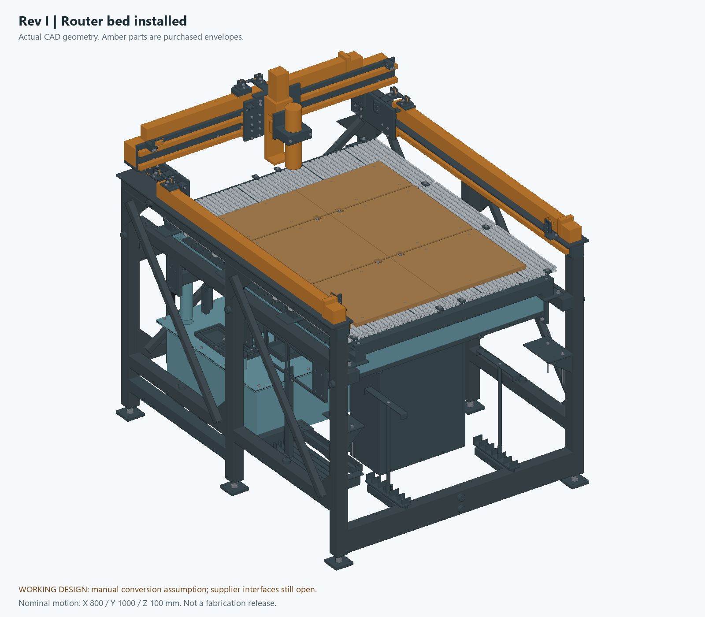

# GM1 — Garcia Mechanical Table

Plasma and router CNC table. Public working design for **800 mm X / 1000 mm Y / 100 mm Z nominal travel**.

**Two working designs, owner's choice pending (26 September 2026).** Neither is a finished, fabrication-ready or operational machine. Two sessions developed the design in parallel on the same day, and they differ mainly in the router bed:

| | **Rev J** (one-piece bed line) | **Rev I** (six-panel line) |
|---|---|---|
| Router bed | One waterproof module of about 63 kg (galvanized steel, aluminum T-slot, HDPE top, no MDF), held by six M10 screws and lifted out through the front on an overhead beam-and-trolley hoist. This is the requirement the owner gave in this session | Six 500 × 397 mm panels, four beams and separate spoilboards stored inside the frame; 52 primary release fasteners plus restraint and tool steps |
| Water service | Rev H reservoir hatches, washout closure and drain reserves; the refill spout is moved clear of the module | Rev H service, plus a supported drain and flange, removable tail and parking cup, strainer carrier, corrected pump orientation and supported hoses |
| Plasma head | Rev H Z-adapter transfer blank and braked-motor candidate; no head mechanism | Floating/breakaway head mechanism; its insert stays unbored until the torch is measured |
| Controls | The owner chose the BTT Rodent with grblHAL here; the Rodent port is not written yet | Kraken V1.1 with onboard drivers, with defined terminal circuits and isolated head inputs |
| Checks | Static, nine motion poses, hoist path and water service: all pass | See its verification index |

Rev J does not yet contain Rev I's head, plumbing, cabinet, structure or control-circuit work. Rev I has no one-piece bed and follows the Kraken. **Which line continues is the owner's decision**; the [26 September follow-up](output/followup-2026-09-26/README.md) lists what each would need.

**Newer development variants (other session, 22:15 UTC):** [small-machine RapidChange ATC, a full-sheet 4x8 machine, and repeatable removable table interfaces](variants/README.md). These have their own CAD and checks. Their supplier interfaces and physical qualification remain open, and they do not replace or inherit the Rev I release status.

**Conflicting owner records.** The variants' [requirements record](variants/requirements.json) lists these among its confirmed requests: "Keep bed conversion within the machine footprint" and "Preserve the preference for Kraken onboard motor drivers". This session recorded something different on the same day: the owner's one-piece bed, lifted out of the front of the machine on a hoist, and the BTT Rodent controller. Only the owner can settle which records stand.

## Open the designs

**Rev J, one-piece bed** (`build_revj.py`):

- [CAD package: the bed module, changing beds, what was checked](output/release-review/RevJ-CAD/README.md)
- [Router assembly STEP](output/release-review/RevJ-CAD/step/RevJ_ROUTER.step); [plasma layout with the module out](output/release-review/RevJ-CAD/step/RevJ_PLASMA_LAYOUT.step) (no invented plasma head); [bed module alone](output/release-review/RevJ-CAD/step/RevJ_BED_MODULE.step)
- [Component schedule](output/release-review/RevJ-CAD/cutlist.csv); [what Rev J changes in the shopping list](outputs/reve-30510/actual-cost/REVJ-PROCUREMENT-DELTA.md)
- [Drive modules, receiving check](output/receiving/MOTION-MODULES.md): Y modules ordered; X and Z to be ordered Monday 28 Sep (please confirm)
- [HGR20 guide rails (still to order): receiving check and Y-rail cut planner](output/receiving/HGR20-RAIL-KITS.md)
- [26 Sep follow-up: owner decisions, procurement, open controls findings and what is left to finish](output/followup-2026-09-26/README.md)

**Rev I, six-panel bed** (`build_revi.py`):

- [CAD package and limitations](output/release-review/RevI-CAD/README.md)
- [Router assembly STEP](output/release-review/RevI-CAD/step/RevI_ROUTER.step); [bed stored assembly STEP](output/release-review/RevI-CAD/step/RevI_BED_STORED.step); [plasma head hardware STEP](output/release-review/RevI-CAD/step/RevI_PLASMA_HARDWARE.step), with the measured torch not yet installed
- [Changes, evidence and reproduction](output/design-finish-2026-09-26/README.md)
- [Verification index](output/design-finish-2026-09-26/ACCEPTANCE.md)
- [Every original audit finding](output/design-finish-2026-09-26/FINDING-DISPOSITION.md)
- [Remaining engineering and measured inputs](output/design-finish-2026-09-26/OPEN-ITEMS.md)
- [Mechanical component schedule](output/release-review/RevI-CAD/cutlist.csv); [selected controls schedule](output/design-finish-2026-09-26/controls/selected-components.json)
- [Development variants: small-machine ATC dock, full-sheet 4x8 machine, shared removable-table locators](variants/README.md)

**Shared and earlier:**

- [Updated concept PDF](output/pdf/plasma-router-stand-concept.pdf); it shows Rev I.
- [Scrap tube lengths and inspection inputs](output/design-completion-2026-09-26/SCRAP-TUBE-GUIDE.md). That list is for Rev H and Rev I; the Rev J list is in its package.
- [X/Y lead check and arrival measurements](output/design-completion-2026-09-26/CONTROL-SCALE-CHECK.md).
- Rev H ([package](output/release-review/RevH-CAD/README.md), [completion report](output/design-completion-2026-09-26/README.md)) and Rev G ([package](output/release-review/RevG-CAD/README.md), [repair evidence](output/cad-repair-2026-09-25/README.md)) are earlier revisions.

## Rev J: one-piece bed

**The bed.** Nine cut-only 1197 mm 20100 profiles sit on a welded 2 × 2 steel frame, topped by two HDPE plates that the machine surfaces in place. Six seat pads and sealed M10 sleeves in the ledgers take the six drawdowns, and two pins locate the module. For plasma, it lifts 70 mm in place, so every part passes above the pan floats. It then travels 1.42 m forward out of the front window on the hoist. That path was checked with the sling modeled, at three hook heights, with the gantry parked at the rear. Rev G's storage racks and slat end reliefs are gone.

**From Rev H:** two gasketed reservoir hatches with upright cover parking, a bolted washout flange and cover, and drain space reserves. It also takes a welded NPS 1/2 refill spout with a 30 mm air gap, a Z-adapter transfer blank and a braked Z-motor candidate envelope. Rev J moves the refill riser from Y1255 to Y1215.4, because the module's rear crossmember stands over the original spot. It also sets the module's end crossmembers and deck 15 mm rearward for clearance. Static, nine-pose motion, hoist-path and water-service checks all pass on the combined model.

This design was first published on this branch as "Rev H" and renamed Rev J, so it does not share a name with the other session's Rev H. Rev I is the other session's next revision.

## Rev I: six-panel bed line

Ten 1220 mm extrusion bars yield thirty 397 mm strips in six 500 × 397 mm panels. The bare bed is 1003 × 1211 mm. Panels, four support beams and separate spoilboards store inside the chassis. Conversion is manual and retains 52 primary release fasteners plus restraint and tool operations. It is not an automatic or quick bed changer.

The head now has twin guides, a 6 mm captured float, a cone/V/flat magnetic release, sealed detection switches, machined clamp features and internal parking. Its replaceable insert remains unbored until the actual torch is measured. The plasma hardware view is therefore a mechanism assembly, not an invented ready-to-cut VIV ARC CUT-50 setup.

Storage rods increase from 10 to 14 mm, with 40 mm sockets and thicker seats. Actual-section calculations replace the earlier incomplete stiffness claim. The proposed light-routing target is 0.20 mm tool-to-work displacement at 100 N; known bed members alone account for about 0.135 mm. Actual motion, mount, joint and tool compliance remain unqualified. Sand receives no elastic-stiffness credit.

The water system gains a supported drain and flange, a removable tail and parking cup, a strainer carrier, corrected pump orientation and supported pressure and suction hose routes. The reservoir stays vented. A compressor or venturi is not connected to the fabricated tank.

[Rev I controls](output/design-finish-2026-09-26/controls/README.md) keep the Kraken V1.1 with onboard drivers. They define actual terminal circuits, timer contacts, an isolated run request, restart prevention and a selected C41S speed converter. Separate [isolated head inputs](output/design-finish-2026-09-26/controls/HEAD-INTERFACE.md) connect the float and breakaway switches. Router Z zero remains manual; the parked plasma float is not a spindle touchplate. Still unfinished: the populated panel, the complete stop/power/brake system, the actual VFD/cutter interface and physical commissioning.

## Common to both

The selected X/Y catalog variants specify **10 mm lead**, meaning movement per screw revolution, not screw diameter. The selected SFU1605 Z has 5 mm lead. Verify the delivered modules before final calibration and adapter drilling.

The 2 × 2 tube list is 30 blanks (29,472 mm / 96.69 ft net) for Rev I and 32 blanks (32,087 mm) for Rev J, using the 3.048 mm modeled wall. Actual scrap lengths, remaining wall and condition must be recorded before nesting. Neither mechanical cut list is a complete electrical BOM or a current delivered purchase total.

Nominal CAD and path checks do not establish whole-machine stiffness, joint capacity, actual interface compatibility, operator access, physical retention or machining accuracy. See each line's evidence for its exact scope and limits. The **VIV ARC CUT-50** still needs exact version and interface information; an AG-60 listing does not identify the owner's actual torch geometry or starting circuitry.

## Evidence, history and cost

Rev J's check records sit in its [package](output/release-review/RevJ-CAD/README.md#what-was-checked), and each matches its sources by hash. Rev I's [verification index](output/design-finish-2026-09-26/ACCEPTANCE.md) binds its assembly, pose, route, service, mechanism, circuit and export reports to their source files. These checks have explicit limits: nominal clear geometry does not establish physical rigidity, force thresholds, operator access, live electrical behavior or machining accuracy.

The generators are [build_revj.py](output/release-review/RevE-ENGINEERING/build_revj.py) (bed in [bed_revj.py](output/release-review/RevE-ENGINEERING/bed_revj.py), water service in [water_revj.py](output/release-review/RevE-ENGINEERING/water_revj.py)) and [build_revi.py](output/release-review/RevE-ENGINEERING/build_revi.py). Shared Python sources keep their legacy directory name; the exports are in RevJ-CAD and RevI-CAD. Rev H, Rev G, older exports and the [29-finding audit](output/cad-reaudit-2026-09-25/README.md) are preserved as historical evidence and are not relabeled as current results.

The [actual-price audit](outputs/reve-30510/actual-cost/REAL-COST.md) follows Rev J: **$5,336.10** priced, with 51 required entries still unpriced ([Rev J procurement delta](outputs/reve-30510/actual-cost/REVJ-PROCUREMENT-DELTA.md)). It does not price Rev I's additions. It is a partial register, not a complete build total. The [earlier price workbook](outputs/reve-30510/CNC-plasma-RevE-budget.xlsx) has not been rebuilt and still shows Rev E quantities.

Apart from the owner's drive-module order, no purchase, vendor message, firmware flash or machine operation is recorded. The two Y HMS40 modules were ordered on 26 September; X and Z are to follow on 28 September. The owner chose the BTT Rodent controller on 26 September, in the session that produced Rev J. The Kraken firmware in `RevE-ENGINEERING/controls/` is the prototype, which Rev I's circuits still use.

CadQuery/OpenCascade generate exchange geometry; ReportLab generates the concept brief. This is not a native Fusion feature-history or machine-specific CAM release. Runtime paths are local Windows paths, and a clean-machine rebuild has not been certified. The [original snapshot manifest](REPOSITORY-SNAPSHOT.json) describes the initial import only. Supplier material retains its existing license notices; this repository grants no new rights over it.
