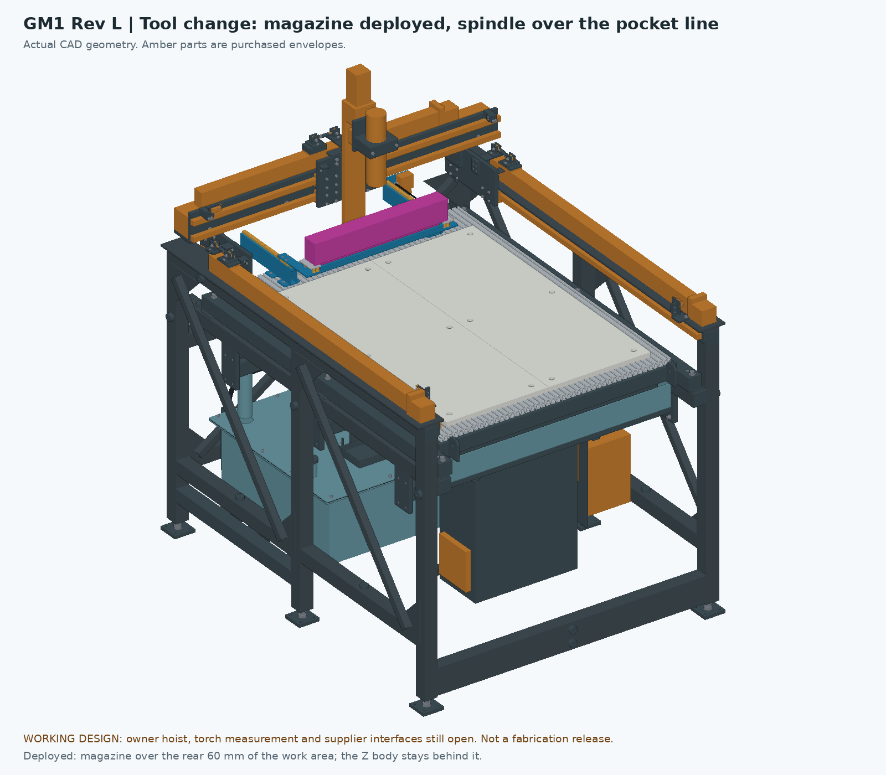
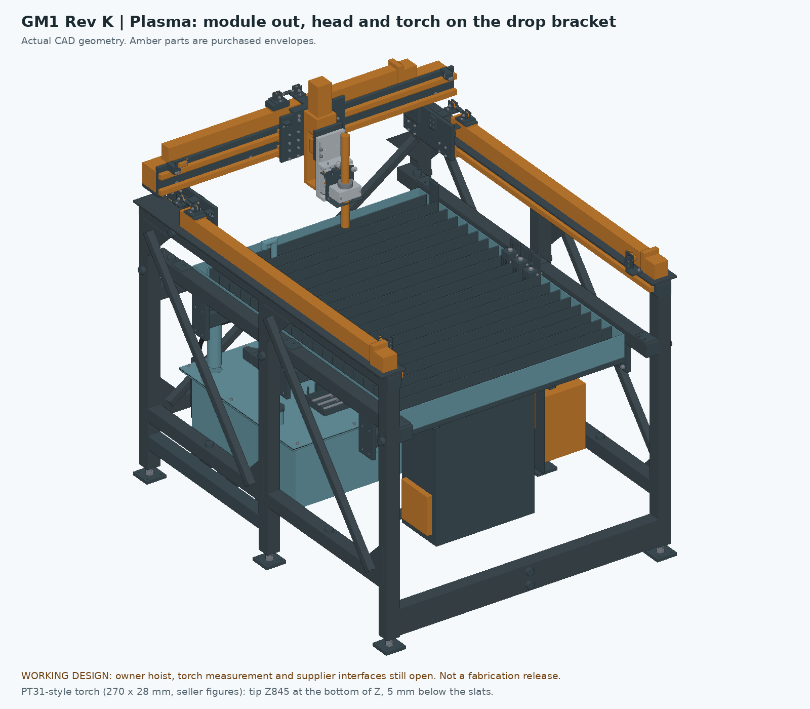
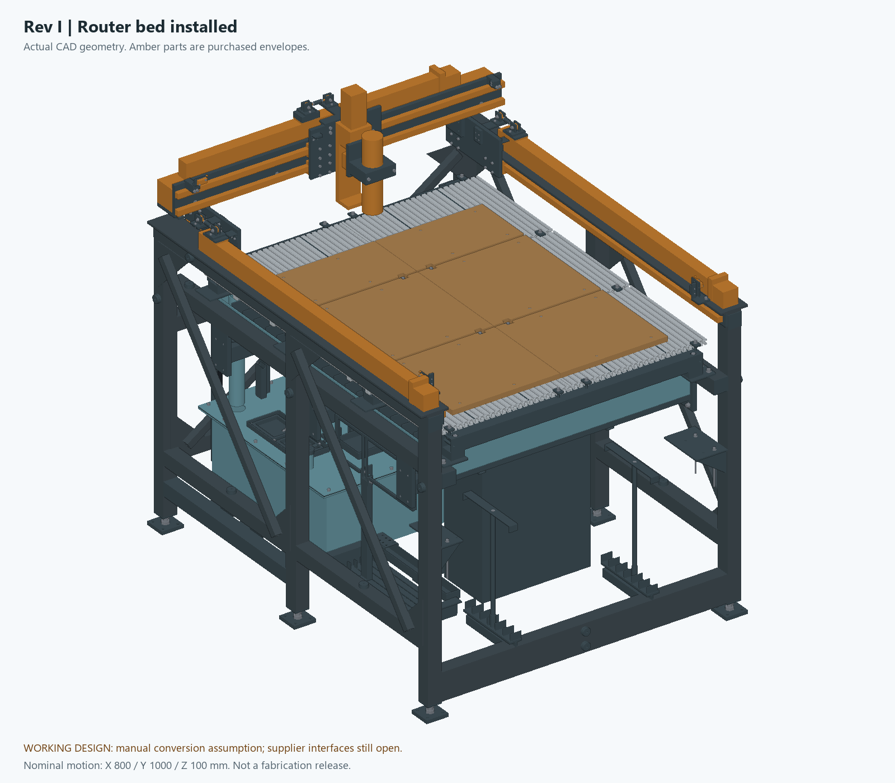

# GM1 — Garcia Mechanical Table

Plasma and router CNC table. Public working design for **800 mm X / 1000 mm Y / 300 mm Z nominal travel** (Rev L; Rev K and earlier have a 100 mm Z).

**Current design: [Rev L](output/release-review/RevL-CAD/README.md), the one-piece bed line with the owner's RapidChange tool changer and a 300 mm Z. The owner chose the one-piece line on 27 September 2026 ("the one piece").** Rev L is [Rev K](output/release-review/RevK-CAD/README.md) with those two additions. It is not a finished, fabrication-ready or operational machine. Two sessions developed the design in parallel. They differ mainly in the router bed, and the other session's six-panel line stays in the repository as the alternative:

| | **Rev L / Rev K** (one-piece bed line) | **Rev I** (six-panel line) |
|---|---|---|
| Router bed | One waterproof module of about 63 kg (galvanized steel, aluminum T-slot, HDPE top, no MDF), held by six M10 screws and lifted out through the front on an overhead beam-and-trolley hoist. This is the requirement the owner gave in this session | Six 500 × 397 mm panels, four beams and separate spoilboards stored inside the frame; 52 primary release fasteners plus restraint and tool steps |
| Water service | Rev H hatches and washout, and Rev I's supported drain, strainer carrier and hoses. Rev K adds a drain screen, a manual reservoir drain, NBR seals, a suction line without a high point and a 32 mm refill air gap | Rev H service, plus a supported drain and flange, removable tail and parking cup, strainer carrier, corrected pump orientation and supported hoses |
| Plasma head | Rev I's floating/breakaway head on a 135 mm drop bracket, with the owner's PT31-style torch (270 × 28 mm). The tip reaches the slats | Floating/breakaway head mechanism; its insert stays unbored until the torch is measured. Its torch cannot reach the slats (review blocker 4) |
| Cabinet | Rev I's box with a shorter drip lip so the door opens, 30 bonded gland entries, a filter fan and the VFD outside | 500 × 400 × 200 box; the review found the door blocked by the drip lip, too few entries and too much heat |
| Tool changer | Rev L: a RapidChange-type magazine on a 200 mm retracting slide mounted on the bed module, so it lifts out with the bed; 300 mm Z | The base branch's retractable carrier variant, drawn on this frame with Kraken drives; Rev I itself has none |
| Controls | **BTT Rodent with grblHAL**, the owner's choice, reconfirmed on 26 Sep. [GM1 controls](output/controls-2026-09-27/README.md) (27 Sep): E-stop, mode-race and welded-relay fixes and the Rodent pin plan, plus a router drain that closes, a fill watchdog, a float stop, and for Rev L spindle reverse and the tool-changer drive. Simulated, not built | Kraken V1.1 terminal circuits and isolated head inputs; the GM1 controls replace its stop and start chain on the Rodent |
| Checks | Rev K: static (0 unresolved in all three states), 9 router poses, 12 plasma poses, the hoist path at three hook heights, and the water and cabinet checks. Rev L adds the 300 mm Z poses, the dock's travel and tool-change poses, and the hoist path with the dock on the module. All pass | See its verification index |

Rev K is the one-piece line completed after the owner's "finish it". It takes Rev J's bed and folds in Rev I's head, plumbing and cabinet, and it fixes the review's plasma-reach, cabinet, water and float findings. Rev I has none of these fixes and follows the Kraken. Rev L then adds the tool changer the owner asked for on 27 September, and the 300 mm Z it is ordered with.

The owner chose the one-piece line on 27 September. The machine goes in a container with an 8 ft ceiling, so the module comes out on a rolling A-frame gantry with a low-headroom hoist ([Rev K: hoist in the container](output/release-review/RevK-CAD/README.md#hoist-in-the-container)). The [26 September follow-up](output/followup-2026-09-26/README.md) records the owner's answers.

**Development variants (other session):** [small-machine RapidChange ATC, a full-sheet 4x8 machine, and repeatable removable table interfaces](variants/README.md) (22:15 UTC), then [retractable ATC mechanisms for both machines](variants/retractable-atc/README.md) (00:54 UTC, 27 Sep). The retractable ATC has a 200 mm slide, automatic pin release, a longer Z for the small machine and a side bay for the 4x8. These have their own CAD, controls model and checks. Their magazine and supplier interfaces and physical qualification remain open, and they do not replace or inherit the Rev I release status. **Controller conflict:** the retractable ATC drives its slide and shutter from the Kraken's spare onboard drivers (S5, S6). The Rodent's four onboard drivers are all used by X, Y, Y2 and Z, and grblHAL's Rodent map supports no fifth motor, so these mechanisms would need a different drive arrangement on the Rodent. Rev L's tool changer has one: a 24 V gearmotor on two relays, driven through the Rodent's I/O expander.

**Controller settled: the BTT Rodent.** The owner confirmed it again on 26 September, after the other session had recorded "Preserve the preference for Kraken onboard motor drivers" in the variants' [requirements record](variants/requirements.json). Rev I's Kraken terminal circuits and isolated head inputs, and the variants' ATC pin reservation, therefore need porting to the Rodent. The [GM1 controls](output/controls-2026-09-27/README.md) do this for the stop, the start chain and the head inputs; Rev L's tool changer uses the Rodent's own I/O (controls M12–M13), so the variants' Kraken pin reservation is not needed. **Settled on 27 September:** the owner chose the one-piece bed, which leaves the machine through the front on a hoist. That supersedes the line "Keep bed conversion within the machine footprint" in the same record.

## Open the designs

**Rev L, one-piece bed with the tool changer** (`build_revl.py`):

- [CAD package: the 300 mm Z, the tool changer on the bed module, tool changes and bed changes with it, what was checked](output/release-review/RevL-CAD/README.md)
- [Router assembly STEP](output/release-review/RevL-CAD/step/RevL_ROUTER.step); [bed module with the tool changer](output/release-review/RevL-CAD/step/RevL_BED_MODULE.step); [tool changer alone](output/release-review/RevL-CAD/step/RevL_DOCK.step); [new parts](output/release-review/RevL-CAD/step/RevL_NEW_PARTS.step)
- [New-parts schedule](output/release-review/RevL-CAD/cutlist.csv); [what Rev L adds to the shopping list](outputs/reve-30510/actual-cost/REVL-PROCUREMENT-DELTA.md)

**Rev K, one-piece bed, completed** (`build_revk.py`), the base of Rev L:

- [CAD package: plasma head and torch, water, cabinet, changing beds, what was checked](output/release-review/RevK-CAD/README.md)
- [Router assembly STEP](output/release-review/RevK-CAD/step/RevK_ROUTER.step); [plasma assembly with the head and torch on the Z](output/release-review/RevK-CAD/step/RevK_PLASMA.step); [bed module alone](output/release-review/RevK-CAD/step/RevK_BED_MODULE.step)
- [Component schedule](output/release-review/RevK-CAD/cutlist.csv); [what Rev K adds to the shopping list](outputs/reve-30510/actual-cost/REVK-PROCUREMENT-DELTA.md)
- The bed module itself, the hoist and the 2 × 2 tube list are unchanged from [Rev J](output/release-review/RevJ-CAD/README.md) ([what Rev J changed in the shopping list](outputs/reve-30510/actual-cost/REVJ-PROCUREMENT-DELTA.md))
- [Drive modules, receiving check](output/receiving/MOTION-MODULES.md): Y modules ordered; X and Z to be ordered Monday 28 Sep (please confirm). **Z: order the 300 mm stroke** for the tool changer
- [HGR20 guide rails (still to order): receiving check and Y-rail cut planner](output/receiving/HGR20-RAIL-KITS.md)
- [26 Sep follow-up: owner decisions, procurement, open controls findings and what is left to finish](output/followup-2026-09-26/README.md)

**Rev I, six-panel bed** (`build_revi.py`):

- [CAD package and limitations](output/release-review/RevI-CAD/README.md)
- [Router assembly STEP](output/release-review/RevI-CAD/step/RevI_ROUTER.step); [bed stored assembly STEP](output/release-review/RevI-CAD/step/RevI_BED_STORED.step); [plasma head hardware STEP](output/release-review/RevI-CAD/step/RevI_PLASMA_HARDWARE.step), with the measured torch not yet installed
- [Changes, evidence and reproduction](output/design-finish-2026-09-26/README.md)
- [Verification index](output/design-finish-2026-09-26/ACCEPTANCE.md)
- [Every original audit finding](output/design-finish-2026-09-26/FINDING-DISPOSITION.md)
- [Remaining engineering and measured inputs](output/design-finish-2026-09-26/OPEN-ITEMS.md)
- [Mechanical component schedule](output/release-review/RevI-CAD/cutlist.csv); [selected controls schedule](output/design-finish-2026-09-26/controls/selected-components.json)
- [Development variants: small-machine ATC dock, full-sheet 4x8 machine, shared removable-table locators](variants/README.md)
- [Retractable ATC mechanisms for both machines (27 Sep, the other session's latest work)](variants/retractable-atc/README.md), with its own machine views, STEP files and controls model

**Shared and earlier:**

- [Review of the other session's Rev H, Rev I and variants (26 Sep)](output/review-2026-09-26/README.md): blockers for both lines, including the Rodent's inputs, the missing E-stop circuit, a mode-switch race and plasma torch reach, plus the 4 × 8 for a friend.
- [GM1 controls (27 Sep)](output/controls-2026-09-27/README.md): the fixes for three of those blockers and two major findings, for either bed line: an E-stop that removes power, the mode-race and welded-relay fixes, and the Rodent pin plan with a draft grblHAL board map. Simulated, not built or flashed.
- [Updated concept PDF](output/pdf/plasma-router-stand-concept.pdf); it shows Rev I.
- [Scrap tube lengths and inspection inputs](output/design-completion-2026-09-26/SCRAP-TUBE-GUIDE.md). That list is for Rev H and Rev I; the Rev J list is in its package.
- [X/Y lead check and arrival measurements](output/design-completion-2026-09-26/CONTROL-SCALE-CHECK.md).
- Rev H ([package](output/release-review/RevH-CAD/README.md), [completion report](output/design-completion-2026-09-26/README.md)) and Rev G ([package](output/release-review/RevG-CAD/README.md), [repair evidence](output/cad-repair-2026-09-25/README.md)) are earlier revisions.

## Rev L: the tool changer

**Rev L (27 September).** The owner wants the RapidChange tool changer on this machine and orders the Z slide on Monday 28 September.

- **300 mm Z.** The same ZBX80 with a longer body. The spindle's lowest reach is unchanged; the nut now rises to Z1260, 210 mm above the magazine, where RapidChange asks for at least 90 mm.
- **The dock rides on the bed module.** Two MGN12 rails on the module's T-slot strips carry a U-shaped carrier with the magazine, and a worm gearmotor retracts it 200 mm behind the Z body when not in use. It lifts out with the bed for plasma, so nothing extra comes off the machine and the plasma never sees it.
- **One rule for tool changes:** the Z slide's lower end is below the magazine top, so the spindle reaches the pockets from the rear stop, never over the magazine from the front.
- **Controls M12–M13:** spindle reverse (RapidChange unloads in reverse) and the dock drive with its interlocks.

Details are in the [Rev L package](output/release-review/RevL-CAD/README.md).

## Rev K: one-piece bed line

**Rev K (27 September).** It adds three things to Rev J, below:

- **Plasma head and torch.** Rev I's floating/breakaway head sits on a 135 mm drop bracket and carries the owner's torch: a PT31-style straight machine torch, 270 × 28 mm (seller's figures from the owner's photo). The tip reaches Z845 at the bottom of Z, 5 mm below the slats. The cutting area on the slats is 800 × 924 mm. Near the pan level sensors, plasma paths stay at X955 or less.
- **Plumbing and cabinet from Rev I.** Rev K also adds a drain screen, a manual reservoir drain, NBR seals, a suction line without a high point and a 32 mm refill air gap.
- **Cabinet fixes.** A shorter drip lip, so the door opens; 30 bonded gland entries; a filter fan; the VFD outside; the torch-start relay moved to the cutter.

The GM1 controls add the matching logic (M9–M11). Details are in the [Rev K package](output/release-review/RevK-CAD/README.md).

**The bed.** Nine cut-only 1197 mm 20100 profiles sit on a welded 2 × 2 steel frame, topped by two HDPE plates that the machine surfaces in place. Six seat pads and sealed M10 sleeves in the ledgers take the six drawdowns, and two pins locate the module. For plasma, it lifts 70 mm in place, so every part passes above the pan floats. It then travels 1.42 m forward out of the front window on the hoist. That path was checked with the sling modeled, at three hook heights, with the gantry parked at the rear. Rev G's storage racks and slat end reliefs are gone.

**From Rev H:** two gasketed reservoir hatches with upright cover parking, a bolted washout flange and cover, and drain space reserves. It also takes a welded NPS 1/2 refill spout with a 30 mm air gap, a Z-adapter transfer blank and a braked Z-motor candidate envelope. Rev J moves the refill riser from Y1255 to Y1215.4, because the module's rear crossmember stands over the original spot. It also sets the module's end crossmembers and deck 15 mm rearward for clearance. Static, nine-pose motion, hoist-path and water-service checks all pass on the combined model.

Rev J was first published on this branch as "Rev H" and renamed Rev J, so it does not share a name with the other session's Rev H. Rev I is the other session's next revision.

## Rev I: six-panel bed line

Ten 1220 mm extrusion bars yield thirty 397 mm strips in six 500 × 397 mm panels. The bare bed is 1003 × 1211 mm. Panels, four support beams and separate spoilboards store inside the chassis. Conversion is manual and retains 52 primary release fasteners plus restraint and tool operations. It is not an automatic or quick bed changer.

The head now has twin guides, a 6 mm captured float, a cone/V/flat magnetic release, sealed detection switches, machined clamp features and internal parking. Its replaceable insert remains unbored until the actual torch is measured. The plasma hardware view is therefore a mechanism assembly, not an invented ready-to-cut VIV ARC CUT-50 setup.

Storage rods increase from 10 to 14 mm, with 40 mm sockets and thicker seats. Actual-section calculations replace the earlier incomplete stiffness claim. The proposed light-routing target is 0.20 mm tool-to-work displacement at 100 N; known bed members alone account for about 0.135 mm. Actual motion, mount, joint and tool compliance remain unqualified. Sand receives no elastic-stiffness credit.

The water system gains a supported drain and flange, a removable tail and parking cup, a strainer carrier, corrected pump orientation and supported pressure and suction hose routes. The reservoir stays vented. A compressor or venturi is not connected to the fabricated tank.

[Rev I controls](output/design-finish-2026-09-26/controls/README.md) keep the Kraken V1.1 with onboard drivers. They define actual terminal circuits, timer contacts, an isolated run request, restart prevention and a selected C41S speed converter. Separate [isolated head inputs](output/design-finish-2026-09-26/controls/HEAD-INTERFACE.md) connect the float and breakaway switches. Router Z zero remains manual; the parked plasma float is not a spindle touchplate. Still unfinished: the populated panel, the complete stop/power/brake system, the actual VFD/cutter interface and physical commissioning.

## Common to both

The selected X/Y catalog variants specify **10 mm lead**, meaning movement per screw revolution, not screw diameter. The selected SFU1605 Z has 5 mm lead. Verify the delivered modules before final calibration and adapter drilling.

The 2 × 2 tube list is 30 blanks (29,472 mm / 96.69 ft net) for Rev I and 32 blanks (32,087 mm) for Rev J and Rev K, using the 3.048 mm modeled wall. Actual scrap lengths, remaining wall and condition must be recorded before nesting. Neither mechanical cut list is a complete electrical BOM or a current delivered purchase total.

Nominal CAD and path checks do not establish whole-machine stiffness, joint capacity, actual interface compatibility, operator access, physical retention or machining accuracy. See each line's evidence for its exact scope and limits. The **VIV ARC CUT-50** still needs exact version and interface information. The owner's photo of 27 September gives the torch: a PT31-style straight machine torch, 270 × 28 mm (seller's figures; measure before boring the clamp).

## Evidence, history and cost

Rev L's, Rev K's and Rev J's check records sit in their packages ([Rev L](output/release-review/RevL-CAD/README.md#what-was-checked), [Rev K](output/release-review/RevK-CAD/README.md#what-was-checked), [Rev J](output/release-review/RevJ-CAD/README.md#what-was-checked)), and each matches its sources by hash. Rev I's [verification index](output/design-finish-2026-09-26/ACCEPTANCE.md) binds its assembly, pose, route, service, mechanism, circuit and export reports to their source files. These checks have explicit limits: nominal clear geometry does not establish physical rigidity, force thresholds, operator access, live electrical behavior or machining accuracy.

The generators are:

- [build_revk.py](output/release-review/RevK-ENGINEERING/build_revk.py): its own folder; it builds on Rev J.
- [build_revj.py](output/release-review/RevE-ENGINEERING/build_revj.py): bed in [bed_revj.py](output/release-review/RevE-ENGINEERING/bed_revj.py), water service in [water_revj.py](output/release-review/RevE-ENGINEERING/water_revj.py).
- [build_revi.py](output/release-review/RevE-ENGINEERING/build_revi.py).

Shared Python sources keep their legacy directory name; the exports are in RevK-CAD, RevJ-CAD and RevI-CAD. Rev H, Rev G, older exports and the [29-finding audit](output/cad-reaudit-2026-09-25/README.md) are preserved as historical evidence and are not relabeled as current results.

The [actual-price audit](outputs/reve-30510/actual-cost/REAL-COST.md) follows Rev J: **$5,336.10** priced, with 51 required entries still unpriced ([Rev J procurement delta](outputs/reve-30510/actual-cost/REVJ-PROCUREMENT-DELTA.md)). Rev K's additions and the GM1 controls parts are listed, all unpriced, in the [Rev K procurement delta](outputs/reve-30510/actual-cost/REVK-PROCUREMENT-DELTA.md), and Rev L's in the [Rev L procurement delta](outputs/reve-30510/actual-cost/REVL-PROCUREMENT-DELTA.md). The audit does not price Rev I's additions. It is a partial register, not a complete build total. The [earlier price workbook](outputs/reve-30510/CNC-plasma-RevE-budget.xlsx) has not been rebuilt and still shows Rev E quantities.

Apart from the owner's drive-module order, no purchase, vendor message, firmware flash or machine operation is recorded. The two Y HMS40 modules were ordered on 26 September; X and Z are to follow on 28 September. The owner chose the BTT Rodent controller on 26 September and reconfirmed it that evening ("we're going to use the Rodent, not the Kraken"). The Kraken firmware in `RevE-ENGINEERING/controls/` and Rev I's Kraken circuits are the prototype and reference for the Rodent port.

CadQuery/OpenCascade generate exchange geometry; ReportLab generates the concept brief. This is not a native Fusion feature-history or machine-specific CAM release. Runtime paths are local Windows paths, and a clean-machine rebuild has not been certified. The [original snapshot manifest](REPOSITORY-SNAPSHOT.json) describes the initial import only. Supplier material retains its existing license notices; this repository grants no new rights over it.
