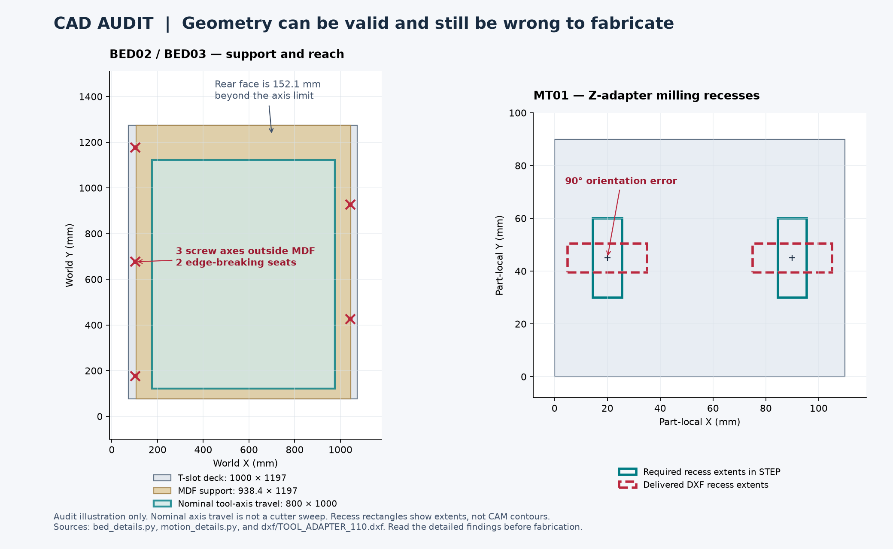

# Full CAD re-audit — 25 September 2026

**Result: the current CAD is not ready for fabrication or a final CAD/CAM handoff.** The audit records **29 findings: 14 high priority and 15 medium priority**. These include confirmed geometry/documentation defects and missing engineering verification; they are not 29 proven structural failures. Related findings sometimes describe different parts of the same unresolved system.

This audit examined the repository at `554530196701756bd5db9a71d199fd89334f35f1`, plus the new audit scripts and evidence. Existing design sources, STEP files, DXFs, firmware and CAD revision were not changed. Navigation/status annotations were added after the checks. The folder still says Rev E; the current bed design calls itself Rev F.

## Findings that must drive the next design revision

| Issue | Evidence and consequence | Finding |
|---|---|---|
| Swap exceeds the required footprint | The module travels 1400 mm forward and is parked outside the machine. The user explicitly required an in-footprint swap. A winch asserted in source comments is not confirmed owned equipment. | BED01, BED11 |
| Five deck fasteners lack full MDF seats | Three screw axes are 2.3 mm outside the support. Two are only 0.7 mm inside its edge. Their holes, pockets and washers do not have the required support. | BED02 |
| Full support surfacing is unreachable | Rear MDF extends 152.1 mm beyond nominal tool-axis travel. The rear outside corner would require a 167.1 mm cutter radius before clearance checks. The instructed 1 mm skim is also absent from the final modeled stack. | BED03, BED08 |
| Z-adapter DXF disagrees with its solid | Two 30 × 11 mm counter-slot recesses are horizontal in the DXF and vertical in the STEP. Following the drawing removes the wrong material. | MT01 |
| Plasma setup is not an operational plasma assembly | The STEP retains the router clamp, parks the spindle, and has no installed torch, floating touch-off or breakaway. The separate torch-clamp solids lack the mounting and pinch holes described in their notes. | MT02, MT03 |
| Bed anchors and location are unfinished | Modeled weldnuts are separated from ledger metal by 1.494 mm without a defined bridging joint. Locator fits, actual receiver bearing, tightening loads and MDF/extrusion preload need defined, verified details. | BED04–BED07 |
| Fabrication features are missing | Cabinet stringers are solid, unperforated tubes despite notes claiming clearance holes. The drip-cap DXF does not define the instructed folds, bend allowances and corner treatment. | FW-02, FW-03 |
| Water servicing and clearances remain unresolved | A simple rearward lid-removal path strikes the rear brace; other paths are not ruled out. The low-water guard has only 0.672 mm nominal floor clearance. Valve, fittings, hose routes and tool-to-guard clearance remain incomplete. | FW-01, FW-04–FW-06 |
| Rigidity and supplier interfaces are not qualified | Valid solids do not establish full frame/tool-loop stiffness, joint capacity, support stability, actual actuator/rail mounting, or Z retention on power loss. | BED09–BED14, MT05–MT07, FW-07–FW-08 |

The figure is an audit illustration, not a manufacturing drawing. The MDF rectangle shows its overall footprint; local float-guard notches are omitted. Tool-axis travel is not the swept envelope of a real cutter.

## What was freshly checked

| Coverage | Result | Evidence |
|---|---|---|
| All CAD exchange files in the repository | **253 files inventoried and hashed: 168 STEP, 85 DXF.** No native Fusion `.f3d` or `.f3z` is present. | [Inventory](inventory.json) |
| Current source rebuild | **967 valid single-solid components**; every component matches the saved assembled record's bounds and volume within the declared tolerances. No duplicate component IDs or local/world volume mismatches. | [Fresh model](fresh-model.json) |
| Complete current assembly STEP imports | All three import as valid geometry; counts are 967 assembled, 967 router and 731 plasma setup. Hashes match the saved readback reports. | [Assembly STEP checks](assembly-step-checks.json) |
| Every current individual STEP | **162 freshly imported files**; no missing/unreferenced part exports or first-instance source volume/bounds mismatches. | [Individual STEP checks](individual-step-checks.json) |
| Historical Rev D assemblies | All three freshly import as valid geometry. They remain superseded and were not requalified for current design requirements. | [Historical STEP checks](historical-step-checks.json) |
| Every current DXF and nest | **85 freshly parsed files**, all in millimetres with no reported DXF audit errors or open cut polylines. Recorded nesting quantities, boundaries and rectangle overlaps pass. | [Drawing checks](drawing-checks.json) |
| Fresh source-to-DXF comparison | **67 individual drawings** match the current flat generator's entities, machining layers and notes. This proves freshness, not correctness: MT01 reproduces the generator's orientation bug. | [Drawing fidelity](dxf-source-fidelity.json) |
| Shared manufactured part numbers | No unresolved geometry differences after the recorded rotation checks. The two module rails are the same part used end-for-end; the coupler also differs only in orientation. | [Part-number checks](part-number-checks.json) |
| Default assembled static geometry | Zero unresolved positive-volume intersections; **86 explicitly permitted intersections** remain subject to joint review. A permission is not proof of an adequate physical joint. | [Fresh static validation](fresh-static-validation.json) |
| Full-machine router motion samples | **All eight nominal X/Y/Z travel-box corners plus the center**: 967 valid solids each, zero unresolved intersections. | [Nine full-machine poses](full-machine-poses.json) |
| Supplied plasma bed/setup view | Fresh reconstruction of the **731-solid** setup: zero unresolved intersections and no saved geometry mismatches after reproducing the original preview/export sequence. This is not an operational plasma head. | [Plasma setup validation](fresh-plasma-display-validation.json) |
| Corrected motion-only fixture | All five original configurations: **295 valid solids each**, zero unresolved intersections and no local/world volume mismatches. | [Motion audit](motion-tools.json) |
| Bed and frame/water subsystem probes | Fresh bed/ledger reconstruction, joint distances, clamp geometry, guard clearances and selected service-path probes. | [Bed audit](bed-structure.json), [frame/water evidence](frame-water-geometry-evidence.json) |
| Square-tube cut schedule | 28 current 2 × 2 blanks fit five full 20-foot bars with the stated trim and kerf. This is not the entire material purchase list. | [Tube schedule](tube-schedule-check.json) |
| Water analytical checks | 147,456 stored-input logic combinations and three transition scenarios rerun successfully; inventory arithmetic also passes its assumptions. No wet test was performed. | [Water rerun](frame-water-water-verification.json) |
| Source syntax | All 26 inventoried Python sources parse. This is not a full execution or correctness test of every script. | [Source inventory](inventory.json) |

## Corrections to earlier audit conclusions

The earlier **22 motion clashes per state are a checker-fixture error**. The standalone checker starts with rail caps at Z1050; the assembled frame first raises them 6 mm and then applies the holes. Rebuilding the fixture in that order removes all 22 overlaps. They must not be presented as physical machine collisions. The saved `motion-validation.json`, `MOTION-VERIFICATION.md` and package checklist still describe different snapshots; this audit's fresh evidence governs the review. The production checker has not been silently patched.

The right-edge MDF screw margin is **0.7 mm**, correcting the earlier 0.9 mm arithmetic. The support defect remains. The shared `MOD_RAIL` part number is valid under the demonstrated end-for-end rotation; an untranslated coordinate difference alone would have produced a false defect report.

The plasma comparison also exposed a checking subtlety: OpenCascade bounding boxes can include cached preview triangulation. The original exporter meshes the router before copying the plasma state. Reproducing that order resolved 620 initial bounding-box differences; component volumes were unchanged throughout. Those differences were not classified as design defects.

## Requirements and dimensions retained

| Item | Current basis |
|---|---|
| Requested travel | X800 × Y1000 × Z100 mm |
| Nominal tool-axis rectangle | X175–975; Y121.4–1121.4 mm, dependent on the unresolved tool/Z stack |
| Bare T-slot deck | 1000 × 1197 mm; ten 1197 mm strips from five two-packs |
| Current assembly bounds | 1206.8 × 1479.2 × 1370 mm, represented hardware only |
| Workplanes | Bare deck Z940.8, optional spoilboard Z959.8, plasma slats Z850 mm; skim/process inconsistency remains BED08 |
| Bed conversion requirement | Must remain within the machine footprint; current forward-hoist architecture does not comply |
| Owned aluminum | Reported 12 × 12 inch pieces in 1/2 and 3/8 inch thickness; quantity, alloy, usable thickness and flatness are unverified. The full-sheet nest is not proof that all aluminum parts fit those owned pieces. |
| Existing cutter | Owner-reported VIV ARC CUT-50; exact start method, revision, torch assembly and CNC interfaces unverified |

## Repair order

1. Restore an in-footprint bed exchange and define its supported/locked/stored states. Model the entire handling mechanism before optimizing details of the rejected forward-hoist route.
2. Define achievable bed datums, support seats, anchor joints, location fits, final skim thickness and controlled fastening. Verify the full structural load path against stated cutting loads and an explicit deflection target.
3. Correct the adapter recess drawing and complete all fabricated clamp, cage and folded-sheet features. Regenerate parts, drawings, operations and nests together, then compare actual feature geometry.
4. Finish the selected motion interfaces, power-loss Z retention, installed router cutting tools and operational plasma head. Add leads, hose bends, way protection and dual-Y skew limits.
5. Complete water connections and service paths, then rerun the assembled states, full travel and exchange path with manufacturing tolerances and real component dimensions.
6. Update the bill of materials and current status reports from the accepted geometry. Only then prepare the fabricator's machine-specific CAM, workholding and postprocessor setup.

## Reports and scope limits

- [Bed, exchange module and structure — 14 findings](bed-structure.md)
- [Motion and tooling — 7 findings](motion-tools.md)
- [Frame, water and cabinet — 8 findings](frame-water-packaging.md)
- [Combined findings register](findings.json) and [repair checklist](repair-checklist.md)

This is a full inventory and current-package CAD/source audit, not physical certification or a claim to have found every possible defect. Interference checks use nominal solids and sampled positions; no continuous swept-volume proof, tolerance simulation, complete stiffness/strength qualification, lifting-system certification, electrical qualification or physical commissioning was performed. Purchased envelopes remain approximations. Historical concept PDFs, firmware and live supplier prices were not re-audited in this CAD-focused pass. No manufacturing G-code was created and Fusion was not launched.

Reproducible checks are in `run_cad_audit.py`, `check_full_machine_poses.py`, `check_plasma_display_state.py` and `frame-water-geometry-check.py`. The main geometry checks used Python 3.12.14, CadQuery 2.7.0 and ezdxf 1.4.4. Run them in a compatible environment; they write evidence beside the audit scripts and leave the design exports unchanged.
