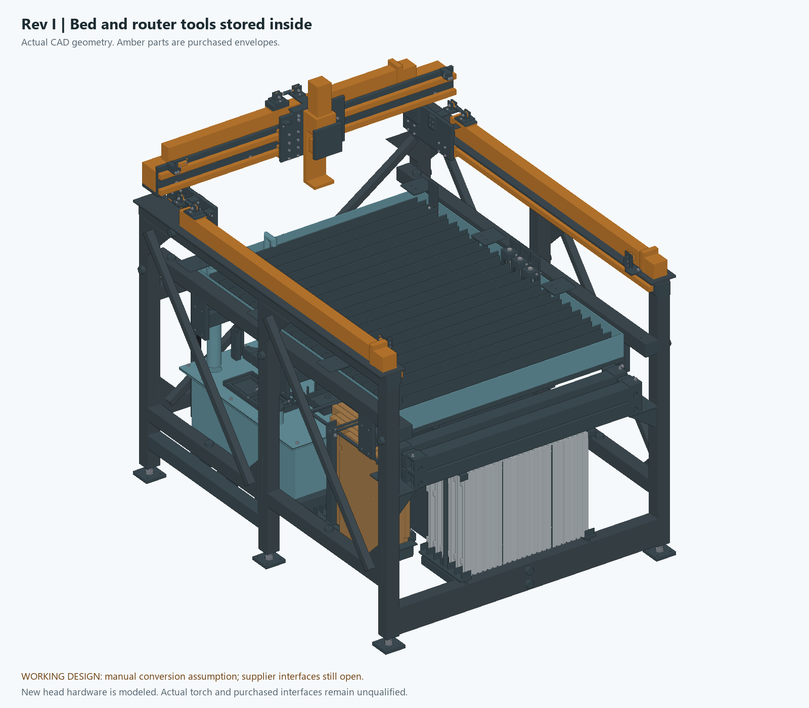
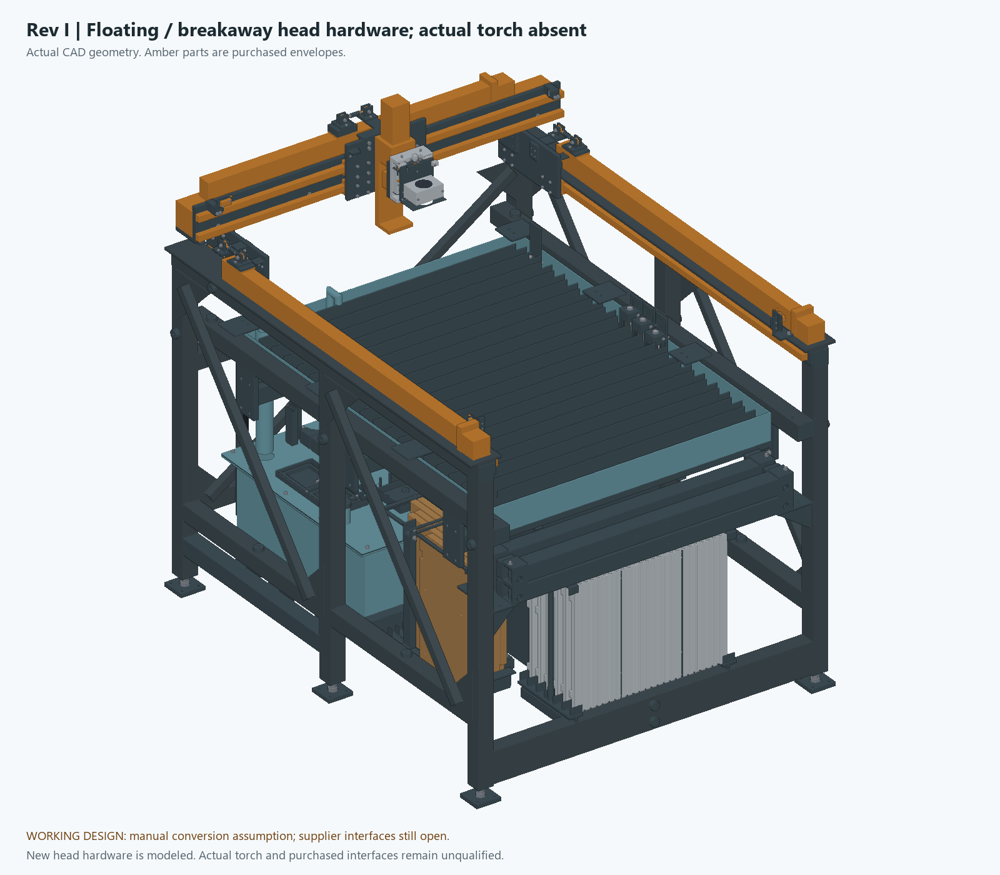
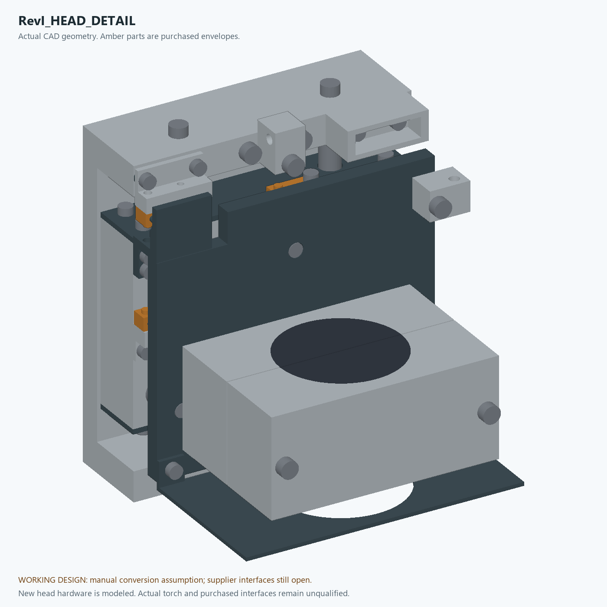

# Rev I — current working CAD

This is the current integrated mechanical package. It includes corrected head,
storage, drain, hose and cabinet geometry. **It is not a fabrication or
operation release.** Unknown purchased interfaces remain guarded; the actual
torch, complete control panel and several operating load paths are unfinished.

## Assemblies and previews

| Assembly | Definition |
|---|---|
| [RevI_ROUTER.step](step/RevI_ROUTER.step) | Six-panel router bed installed; plasma head hardware in its internal parking cradle |
| [RevI_BED_STORED.step](step/RevI_BED_STORED.step) | Panels, boards, beams and router tooling stored; head hardware still parked |
| [RevI_PLASMA_HARDWARE.step](step/RevI_PLASMA_HARDWARE.step) | Stored bed and installed floating/breakaway hardware with an unbored insert; no actual torch |

## Fabrication data and limits

- [Mechanical inventory](cutlist.csv) and [machine-readable inventory](cutlist.json).
- [Part operations and machining-layer definitions](part-operations.json).
- [Individual STEP solids](parts/) and [flat DXFs](dxf/).
- [2-inch tube reference nest](TUBE-CUT-PLAN.md); actual scrap needs a new nest from sound measured lengths.
- [Plate/sheet nesting](nesting/); a full-sheet layout does not establish fit in the owner's uncounted 12 × 12 inch aluminum pieces.
- [Integrated manifest and source identities](engineering-manifest.json).
- [Current verification index](../../design-finish-2026-09-26/ACCEPTANCE.md).
- [Exact changes and reproduction commands](../../design-finish-2026-09-26/README.md).
- [Remaining engineering inputs](../../design-finish-2026-09-26/OPEN-ITEMS.md).

The bare bed is 1003 × 1211 mm. Six 500 × 397 mm panels use ten 1220 mm bars
cut into thirty 397 mm strips. Nominal axis travel is 800 X / 1000 Y / 100 Z;
it is not a promise of that entire useful cutting area with every tool.
Router and plasma head offsets differ. Actual nozzle/cutter, guards, stock
and clamping determine useful process access.

The square-tube chassis remains 2 × 2 inches with 3.048 mm nominal wall.
Thirty blanks total 29,472 mm / 96.69 ft before kerf and trim. The new storage
rods, service supports, plate, sheet and purchased parts are additional stock.
Sand-filled stationary tubes receive no elastic-stiffness credit.

Read each part's operations before CAM. Drilling, tapping, countersinks,
pockets, bores and locating features are not all through-cut DXF contours.
Purchased envelopes and measured interfaces are excluded from unguarded
individual manufacturing exports. An exported custom part still needs its
specified material, fit, tooling, workholding and machine-specific CAM.
No G-code or native Fusion feature-history file is released.

Manual conversion retains 52 primary fasteners plus restraints and tool
operations. Follow the current structural and head handling sequences; a
clear endpoint is not proof of a clear transfer. Nominal path proofs exclude
hands, flexible leads, manufacturing error and physical handling capacity.
The cabinet is serviced with the front storage racks empty.

The [combined conversion sequence](../../design-finish-2026-09-26/motion/CONVERSION-SEQUENCE.md)
defines when the router is removed, which panel remains as a temporary work
surface, and when the front beam moves. Changing that order invalidates the
corresponding obstacle assumptions.

The generator is `../RevE-ENGINEERING/build_revi.py`; the legacy directory
name is retained for reproducibility. Rev G and Rev H exports are historical.
Current drawings, parts, report hashes and the concept PDF must be regenerated
together after geometry changes. The public repository's availability does
not change the engineering release status.
