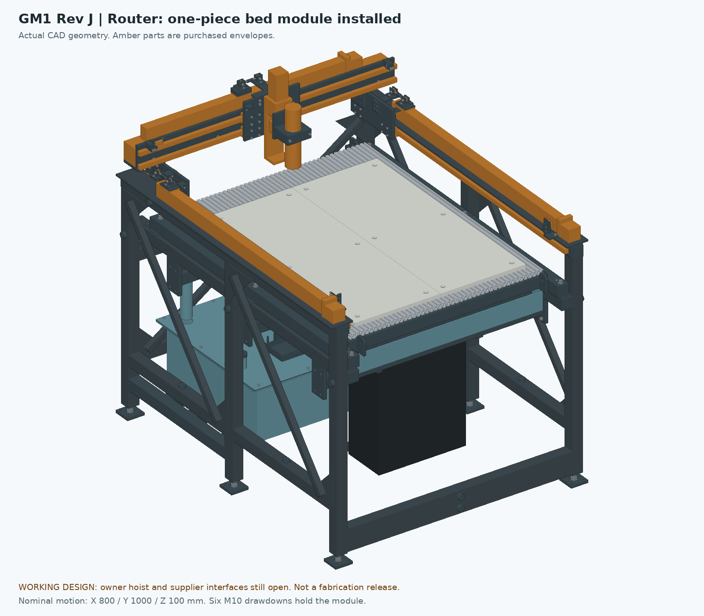

# GM1 Rev J — one-piece hoisted router bed

**GM1 — Garcia Mechanical Table.** Working design for review, **not released for purchasing, fabrication, CAM or operation.** Amber parts in the previews are purchased-part envelopes whose interfaces are not all verified.

Rev J answers the owner's requirement of 26 September 2026: *one piece, lifted out with a winch, at most about 12 screws of M8–M12, waterproof for mist coolant when cutting aluminum.* It replaces the Rev G six-panel manual bed with a one-piece module. It also carries the base branch's Rev H water-service and Z-adapter work:

- two gasketed reservoir hatches with upright cover parking;
- the bolted washout flange and cover, and the drain space reserves;
- the refill spout, moved clear of the module;
- the Z-adapter transfer blank and the braked Z-motor candidate envelope.

The frame, water table, controls packaging and motion are otherwise unchanged from Rev G.

**Name:** this design was first published on this branch as "Rev H". The base branch now has its own Rev H: the six-panel bed with storage restraints, in [RevH-CAD](../RevH-CAD/README.md). This one was therefore renamed Rev J on 26 September 2026. Rev I is skipped because drawing revisions don't use the letter I, which reads as 1.

- [Router assembly STEP](step/RevJ_ROUTER.step) — bed module installed
- [Plasma layout STEP](step/RevJ_PLASMA_LAYOUT.step) — module out of the machine; spindle, clamp hardware and drawdowns stored (no plasma torch is modeled)
- [Bed module STEP](step/RevJ_BED_MODULE.step) — the part the hoist carries
- Previews: [router](previews/RevJ_ROUTER.png), [front](previews/RevJ_ROUTER_front.png), [plasma layout](previews/RevJ_PLASMA_LAYOUT.png), [module](previews/RevJ_BED_MODULE.png), [module underside](previews/RevJ_BED_MODULE_underside.png)
- [Component schedule](cutlist.csv), [operations](part-operations.json), [individual STEP parts](parts/), [flat DXFs](dxf/), [tube cutting plan](TUBE-CUT-PLAN.md), [sheet nesting](nesting/sheet-nesting.json)
- Checks: [hoist path with rigging](handling-check.json), [nine motion poses](motion/revj-full-machine-poses.json), [water service and refill spout](water-service-check.json), validations for the [router](RevJ_ROUTER-validation.json), [plasma layout](RevJ_PLASMA_LAYOUT-validation.json) and [module](RevJ_BED_MODULE-validation.json), [manifest and source hashes](engineering-manifest.json)
- [What Rev J changes in the shopping list](../../../outputs/reve-30510/actual-cost/REVJ-PROCUREMENT-DELTA.md)

## How Rev J meets the requirement

| Owner requirement | Rev J |
|---|---|
| One piece, lifted out with a winch | One welded, galvanized module, **about 63 kg** (model estimate; weigh it). Four lift lugs take a 4-leg sling to an overhead beam-and-trolley hoist. |
| At most about 12 screws, M8–M12 | **Six M10 × 80** stainless socket screws hold it down; two Ø10 pins locate it. Nothing else is removed for a bed change. |
| Waterproof for mist coolant on aluminum | No wood or MDF. Hot-dip galvanized steel, 6063 aluminum T-slot, HDPE top plates, stainless (A4) fasteners. |

Rev G needed 52 screws, 24 loose nuts and 18 separate pieces handled for each change. The base branch's Rev H keeps those 52 screws and adds restraint steps. Rev F was one piece, but it was 87 kg and relied on MDF surfaced in the machine.

## The module

| Item | Nominal model |
|---|---|
| Stack (Z above floor) | ledger 840 → 6 mm seat pads 846 → 2 × 2 rails 846–896.8 → 2 × 2 crossmembers 870–920.8 → 20100 T-slot 920.8–940.8 → HDPE 940.8–**958.8** (same work height as Rev G) |
| Frame | Two 2 × 2 × .120 side rails, 1,337 mm with welded end caps, X62–112.8 and X1037.2–1088. Four 2 × 2 × .120 crossmembers, 912.4 mm, centred at Y100.4 / 476 / 867 / 1272.4, each closed by 6 mm end plates welded over the full rail height |
| T-slot deck | Nine cut-only 20100 profiles, 1,197 mm (one saw cut per 1,220 mm bar), X125–1025 × Y88–1285, slots front-to-back. Each is held by one M5 screw per crossmember, driven from inside the tube into a square nut in its bottom slot (36 screws, installed once) |
| Top | Two HDPE plates, 398 × 1,000 × 18 mm finished from 3/4 in sheet, X176–574 and X576–974, Y130–1130, surfaced in the machine. Twelve counterbored M5 screws go into top-slot nuts. Each plate has one fixed hole and slots or oversize holes elsewhere, because HDPE grows about 0.15 mm per metre per °C |
| Lift lugs | Four 3/8 in plates welded to the end crossmembers at X150 and X1000, beyond both deck ends; Ø14 holes for 3/8 in screw-pin shackles |
| Seating | Six 6 mm pads welded on the ledger tops (front, middle and rear on each side), faced coplanar after welding. The M10 screws go through compression sleeves in the rails into sealed, tapped sleeves welded through the sand-filled ledgers before filling. The left front pin fits a round hole; the right front pin fits a slot along X |
| Mass and centre of mass | 63.4 kg: steel weldment 31.7, aluminum strips 17.8, HDPE 13.6, hardware 0.3. Centre of mass X575.0, Y669.5, Z912.2, midway between the four lugs |

The front and rear crossmembers and the deck sit 15 mm further back than in the first ("Rev H") layout of this module. That leaves 21 mm between the rear crossmember and the relocated refill spout, and 25 mm to the pan-empty float backrail.

The HDPE plates are the precision work surface; surface them in place after the module is seated. For a vise or fixture plate, remove one HDPE plate (six screws) and bolt the vise to the T-slots. The side strips (X125–176, X974–1025) and both deck ends stay uncovered for clamps. In X both plates lie inside the tool-centre travel (X175–975). In Y they run 130–1130, so a surfacing cutter of 25 mm diameter or more reaches their whole face. That holds for the nominal travel (Y121.4–1121.4) and also if the ZBX80 turns out to put the tool up to 20 mm further back ([receiving check](../../receiving/MOTION-MODULES.md)).

**Stiffness screen, not a rating:** a crossmember treated as a simply supported 912 mm beam deflects about 0.07 mm under 200 N at midspan (I = 222,160 mm⁴). A side rail between pads (645 mm) deflects about 0.06 mm under 500 N. Joint stiffness, pad flatness and the whole machine loop are not included.

## Water service carried from the base branch's Rev H

The reservoir hatches, cover parking, washout flange and drain reserves are the base branch's `water_completion.py`, unchanged. Its [water report](../../design-completion-2026-09-26/water/README.md) explains them.

Rev J changes one thing there: the **refill spout**. In Rev H its riser stands at Y1255, under this module's rear crossmember, where the spout's inverted U (top Z895.65) cannot fit. `water_revj.py` builds the same NPS 1/2 miter spout one slat bay forward:

| Item | Rev J |
|---|---|
| Riser | X385, Y1215.4, between slats 18 and 19, from Z665 under the pan to Z885 |
| Head and outlet | Turns 40 mm along −X; the outlet points down at X345, low edge Z865. That is **30 mm above the Z835 pan rim**; keep at least 25 mm as built |
| Nearest parts | Rear crossmember 20.95 mm, deck 25.15 mm, slat 18 31.7 mm; slat 19, pan bearer 3 and its cradle web 3.95 mm each |
| Support | 6 mm floor gusset (J_REFILL_GUSSET) instead of the Rev H stay to the rear wall, which would now pass under slat 19 |
| Hose connection | 1/2 NPT male end at Z665, below pan bearer 3 (Z679); keep-out reserve X335–435, Y1165.4–1265.4, Z545–665 |

The whole spout sits at Y1204.75–1226.05, behind the rear end of tool travel (tool centre Y1121.4). As in Rev H, it stands 45 mm above the slat tops, so plasma sheets must stay in front of about Y1200. Check the 3.95 mm gaps at fit-up.

The Z-adapter transfer blank and the braked-motor candidate come from the base branch's `motion_completion.py`, unchanged. The candidate is a replacement NEMA 23 motor with a 24 V power-off brake (StepperOnline 23HS30-5004D-B280). Its envelope raises the Z-motor top from Z1370 to Z1430.5. Its fit to the ZBX80 is unverified, so it is not a purchase yet.

## Changing beds

Router to plasma:

1. Router off and isolated. Remove the spindle or raise Z fully.
2. Gantry at the front: remove the two **rear** M10 screws. They sit under the Y guide shoes when the gantry is at the back.
3. Gantry to the rear stop, head at X575. Remove the other four screws. All six and their washers go in the bolt tray on the reservoir lid.
4. Shackle the 4-leg sling to the four lugs, take up the slack and **lift 70 mm**. The pins leave the pads, and every part of the module passes at least 6 mm above the pan-float backrails.
5. Run the trolley forward about 1.42 m, guiding the module through the front window by hand. It has 11.2 mm to the frame legs on each side. Two people.
6. Lower the module onto its stand in front of the machine. Don't leave it hanging over a walkway. Clear chips, then follow the plasma water sequence ([WATER-CONTROL.md](../RevE-ENGINEERING/WATER-CONTROL.md)).

Plasma to router is the reverse. Lower the module straight down over the last 70 mm: the refill spout stands 21 mm in front of the rear crossmember, and the float backrails 14.5 mm inside the right rail. The pins then seat the module; refit the six screws (anti-seize, 30 N·m nominal) and re-probe the HDPE. With the module out, the seat pads (top Z846) stay 4 mm below the slat tops (Z850), and the slats are back to full height without the Rev G end reliefs. Wide plasma sheets therefore rest on the slats.

## What the owner provides

- **Hoist and beam:** an overhead beam over the machine centreline, from above the module's centre of mass (Y670) to at least 1.6 m in front of the machine. Use a trolley and hoist rated well above the module; a 250 kg class hoist is ample for 63 kg.
- **Hook height:** use the recommended sling, with the hook 1.0 m above the lug holes, legs about 1.25 m long and 52–53° from horizontal. With the module raised, the hook then sits about 1.99 m above the floor and every sling leg stays more than 40 mm from the machine. Add the hoist's own headroom to find the minimum beam height, typically 2.4–2.6 m.
- **Other hook heights checked:** a 0.7 m hook rise passed, but its legs are at 42–43°, flatter than the usual 45° minimum. A 2.0 m rise also passed, but one rear leg then comes within 8.6 mm of the rear-parked X rail.
- **Rigging:** 4-leg chain or round-sling bridle and four 3/8 in screw-pin shackles, sized for the module with the leg angle above.
- **Stand:** a stand or cart for the 1,026 × 1,340 mm module in front of the machine, clear of the lug and pin positions. Plan about 1.5 m of floor in front of the machine.

The hoist parks in front of the machine during cutting. The gantry and the Z motor (top Z1430.5 with the braked candidate) pass under the beam line.

## 2 × 2 tube for the scrapyard

The owner is sourcing 2 × 2 inch tube at a scrapyard (recorded on the base branch, 26 September 2026). The base branch's [scrap tube guide](../../design-completion-2026-09-26/SCRAP-TUBE-GUIDE.md) lists Rev H's 30 blanks, which include four 924 mm bed beams. Rev J needs these 32 blanks instead (net 32,087 mm, 105.3 ft):

| Quantity | Finished blank, mm | Inches | Rough piece at least | Used for |
|---:|---:|---:|---:|---|
| 4 | 1450 | 57.09 | 58 in | top rails and bed ledgers |
| 2 | 1330.9 | 52.40 | 53 in | module side rails |
| 7 | 1048.4 | 41.28 | 42 in | frame |
| 3 | 1016.4 | 40.02 | 41 in | frame |
| 6 | 949.2 | 37.37 | 38 in | frame |
| 4 | 912.4 | 35.92 | 37 in | module crossmembers |
| 6 | 648.8 | 25.54 | 26 in | frame |

Its inspection rules apply unchanged: measure the wall on clean metal, reject pitting, splits and buckles, and send back lengths, wall and price. For the six module pieces, pick straight, **unpainted** tube: paint has to be blasted off before hot-dip galvanizing, because the galvanizer's pickling does not remove it. New stock needs five 20 ft bars plus one 8 ft length ([tube cutting plan](TUBE-CUT-PLAN.md)).

## What was checked

| Check | Result |
|---|---|
| Static interference, router state | 978 solids, 0 unresolved overlaps; STEP reimport matches |
| Static interference, plasma layout and module alone | 829 and 149 solids, 0 unresolved overlaps |
| Nine router poses (X/Y/Z travel corners and centre), with the Z-adapter blank and braked-motor candidate at every pose | **Pass**: 978 solids in each pose, 0 unresolved overlaps ([motion check](motion/revj-full-machine-poses.json)) |
| Hoist path: module and 4-leg sling moved as one rigid body, gantry at the rear stop, spindle left in place as an obstacle | **Pass** at hook heights 0.7, 1.0 and 2.0 m above the lug holes: 74 sampled poses each (lift every 5 mm, travel every 25 mm), 0 intersections ([hoist check](handling-check.json)) |
| Water service | **Pass** ([water check](water-service-check.json)): router, plasma-layout and hatch-open states with 0 unresolved overlaps. Both hatch covers lift, park upright and lower into their pockets (8 path segments); the washout cover lowers and withdraws (2 segments). All paths run in the plasma layout, with the tool and drawdowns stored. The refill spout has its 30 mm air gap |

Nearest modeled gaps with the module raised 70 mm:

| Obstacle | Gap |
|---|---|
| Frame legs, each side | 11.2 mm |
| Float backrails (6 mm above their tops) | 14.5 mm |
| Y-block bolts | 18.8 mm |
| Rear frame brace, to the rear lugs | 23.0 mm |
| Y guide shoes | 23.15 mm |
| Z slide body | 29.2 mm |

These are nominal CAD gaps. Weld distortion, sling stretch, swing and debris all eat into them. Every check record matches the committed sources by hash.

Not checked or not released:

- Rigging hardware, beam and hoist ratings, chain sag and shackle bodies.
- Module weight, and a proof load of the lugs: lift once at twice the module mass before first use.
- Pad coplanarity and a repeat-seating map.
- The actual 20100 section, nut fit and M5 preload.
- Galvanizing distortion.
- The owner's stand, and human handling.
- Refill hose and fittings, and the braked motor's fit.

## What changed

**From Rev G:**

- **Removed:** six panels and 24 aluminum ties, four beams with feet, seats and sleeves, two removable front seats, 16 clamp bridges, six MDF spoilboards, all storage racks, and the hardware rack on the cabinet cage. The controls cabinet no longer needs the bed reinstalled before it can be opened.
- **Restored:** full-height plasma slats. Rev G had relieved both ends by 22 mm.
- **Added:** the module, six seat pads, six ledger sleeves, the bolt tray, and the module hardware listed in the cut list. From the base branch's Rev H, the reservoir hatches, washout closure, drain reserves, refill spout (moved), Z-adapter blank and braked-motor candidate.
- **Extrusion:** nine 1,197 mm pieces from the same five two-packs (ten bars, one spare) instead of thirty 397 mm pieces.

**From the base branch's Rev H:** its six-panel bed and all its storage restraints are left out: nut strips, beam-stack locks, panel hoops, spoilboard guard and temporary keepers (`bed_completion.py`). The refill riser moves from Y1255 to Y1215.4, and a floor gusset replaces its stay.

The sources are in [RevE-ENGINEERING](../RevE-ENGINEERING/):

- `bed_revj.py`: module and receiver.
- `water_revj.py`: Rev H water service with the moved spout.
- `build_revj.py`: exports.
- `verify_revj_motion.py`, `revj_handling_check.py`, `verify_revj_water.py`: checks.
- `render_revj.py`: previews.

Two alternatives are kept: the base branch's Rev H ([RevH-CAD](../RevH-CAD/README.md)) and Rev G ([RevG-CAD](../RevG-CAD/README.md)). Both are six-panel manual beds stored in the machine footprint.
