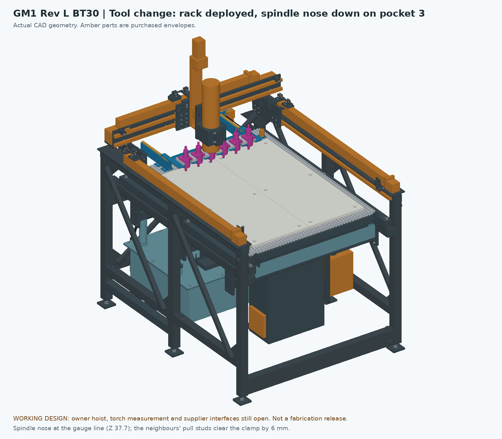

# GM1 Rev L, BT30 variant — a 3.2 kW BT30 ATC spindle and a fork rack on the dock

**GM1 — Garcia Mechanical Table.** Working design for review, **not released for purchasing, fabrication, CAM or operation.** In the previews, amber parts are purchased-part envelopes and magenta parts are allocations (the holders, the forks and the tool in the spindle), not supplier drawings.

The owner asked for "two types of each.... the er17 and the bt30", with a link to a 3.2 kW, 24,000 rpm, 4-pole BT30 ATC spindle (Amazon B0HJ89DJL6). The ER version is [Rev L](../RevL-CAD/README.md) as it stands: an ER11 spindle and the RapidChange magazine (ER16 or ER20 would only change the nut and the magazine pockets; there is no ER17). This page is the BT30 version. It is Rev L with the spindle, its clamp and adapter, the rack on the dock and the parking cradle changed, and nothing else: the frame and its fill holes, the one-piece bed module and its hoist, the water table, the plasma head and torch, the raised 300 mm Z, the dock's beams, rails, drive, stops and sensors, and the cabinet are Rev L's.

- [Router assembly STEP](step/RevLBT30_ROUTER.step): dock parked, gantry at the rear stop, Z fully up, a holder in the spindle
- [Plasma assembly STEP](step/RevLBT30_PLASMA.step): module and dock out, the spindle parked on the reservoir lid, the plasma head on the adapter
- [Bed module STEP](step/RevLBT30_BED_MODULE.step): the module with the dock deployed, as the hoist lifts it
- [Dock STEP](step/RevLBT30_DOCK.step): the dock alone, deployed
- [What differs from Rev L](step/RevLBT30_NEW_PARTS.step): the head (adapter, clamp, screws, the spindle and holder envelopes), the carrier and rack, and the parking cradles, with the [component schedule](cutlist.csv), [operations](part-operations.json), [individual STEP parts](parts/) and [flat DXFs](dxf/)
- Previews: [router](previews/RevLBT30_ROUTER.png), [router from the right](previews/RevLBT30_ROUTER_side.png), [tool change](previews/RevLBT30_TOOL_CHANGE.png), [tool change from the front](previews/RevLBT30_TOOL_CHANGE_front.png), [dock close-up](previews/RevLBT30_DOCK_DETAIL.png), [plasma](previews/RevLBT30_PLASMA.png), [bed module](previews/RevLBT30_BED_MODULE.png)
- Checks: [poses, dock travel, tool change and hoist path](revl-bt30-checks.json), [manifest and source hashes](engineering-manifest.json), and the validations of each STEP
- [What the BT30 changes on the shopping list](../../../outputs/reve-30510/actual-cost/REVL-BT30-PROCUREMENT-DELTA.md)

## The spindle, and what is assumed about it

The listing could not be read from here (Amazon is blocked), so the spindle is drawn from its title and from the JGL-100 class of BT30 spindles it belongs to. **Check these against the listing before ordering anything else:**

| Assumed | Value | Why it matters |
|---|---|---|
| Body | Ø105 × 450 mm cylinder (a JGL-100-class body is 100 across and shorter; the envelope is larger on purpose) | The clamp bore and the parking cradles |
| Mass | 15 kg | The Z slide carries about 20 kg with the clamp and adapter |
| Power | 3.2 kW, 220 V, 3-phase from a VFD; 4-pole, so 24,000 rpm is **800 Hz** | The VFD must output 800 Hz; many stop at 400 |
| Tool change | Pneumatic drawbar, 6–8 bar, with "clamped" and "released" sensors | Air supply, valve and two inputs (controls M15–M16) |
| Holders | BT30 with a 60 mm projection (BT30-ER32-60 class): flange 46 × 16 under the gauge line, nut Ø50, taper 48.4 and pull stud 26 above the gauge line | The rack heights below |

The spindle nose sits **60 mm higher** than Rev L's ER11 nut (Z1020 + z instead of Z960 + z), so a 60 mm holder's nose lands on Rev L's tool datum and the cutting envelope is unchanged: the holder nose reaches Z960 at the bottom of Z, 1.2 mm above the HDPE, and Z1260 at the top.

## The head

**Clamp.** One piece of 6061, 130 wide × 130.5 deep × 100 tall, bored 105 (to the measured body), slit 3 mm at the front between two 20 × 25 lugs. Two M8 × 60 pinch bolts pass through the lugs along X; eight blind M6 holes in its back (X±45, Z+12/38/64/90 from the output datum) take the M6 × 20 screws from the adapter. It grips the lower 100 mm of the spindle, 65 mm above the nose. Walls: 13 mm behind the bore, 12.5 beside and ahead of it.

- **Why one piece, 130 wide.** A two-piece clamp with its pinch bolts beside the bore comes out 154 wide, and at X175 that hits the gantry's left Y shoe (X101.5) at the bottom of Z: 24 mm of X travel gone at each side. The one-piece clamp's edge is at X110, 8.5 mm from the shoe, so the **full 800 mm X travel is kept**. The checks below run the corners with it.
- **Tool axis.** The bore's centre is 65.5 mm ahead of the adapter's front face, against 45.5 for the ER11 clamp, and the adapter is 6.35 mm thicker: the tool axis is **26.35 mm further forward** than Rev L's, at Y = gantry Y − 179.95. The work area is Y95–1095 instead of Y121–1121; the front 13 mm of it is over the pan's front wall, so either set the front soft limit there or accept 987 mm of Y over the HDPE. The rack moves forward with it, so the tool change happens at the same gantry position as in Rev L (Y1253.6).

**Adapter.** Rev L's 110 × 220 drop adapter in 3/4 in (19.05) plate instead of 1/2 in, with the eight clamp holes and the same web thicknesses behind the screws (6.7 mm at the clamp screws, 6.1 mm at the carriage screws), so the same M6 × 20 clamp screws and the same carriage screws fit, and the **plasma drop bracket bolts to its lower four holes unchanged** (the torch axis moves 6.35 mm forward with the thicker plate; the plasma checks below use that). Stiffness: 3.4 times Rev L's plate, about 0.012 mm per 100 N at the clamp, which a 20 kg head and 3.2 kW of cutting deserve.

**The Z slide.** The ZBX80 now carries about 20 kg (spindle 15, clamp 2.5, adapter 1.9, holder 0.9) with its centre about 130 mm ahead of the carriage. Its moment rating is not published. This is the variant's largest open question, together with the Z brake that Rev K already lists: a NEMA23 on a 5 mm-lead screw holds 20 kg only while powered.

## The rack on the dock

The RapidChange magazine, its lid, the saddles and the risers are replaced by a fork rack on the same carrier tray; the dock's beams, rails, blocks, drive, stops and sensors are Rev L's, and its 200 mm travel is unchanged.

| Item | BT30 variant |
|---|---|
| Rack bar | 520 × 80 × 5/8 in 6061 on the tray (Z1026.35–1042.225), six slots 52 mm wide open to the front, round ends on the pocket line; six M5 from below |
| Pockets | Six, at **90 mm** pitch, X350–800; pocket line **Y1073.65** when deployed (Y1273.65 parked) |
| Forks | Plastic BT30 forks (allocation 60 × 60 × 11.5) on the bar, U open to the front; their lips sit in the flange groove at **Z1049.7**. The holder's gauge line is at **Z1057.7** |
| Stored holders | Pull-stud tops at **Z1132.1**: 10.9 mm under the gantry's lowest members (Z1143) and 17.9 mm under the Z body (Z1150). Noses at Z997.7; cutters may project at most **30 mm below the nut**, to Z967.7, 8.9 mm above the HDPE |
| Carrier tray | Rev L's plate, 26.35 mm longer at the front (Y1038.65–1165 deployed), with six 56 mm slots open to the front for the hanging nuts, which slide in and out through them at the fork height. No front upstand: the bar stiffens the front |
| Deployed | Over the rear 57 mm of the work area (Y1038.65–1095). The tray's lowest screw heads are at Z1015 |
| Mass | Dock **14.9 kg** (Rev L 10.6), with six holders at 0.95 kg and forks at 0.06 kg as placeholders. The module becomes about **78 kg** (Rev L 74); with the dock deployed for a lift its centre of mass is at Y763 (Rev L 745) |

**Why the pitch is 90, and why 30 mm of cutter.** With the spindle nose at a holder's gauge line, the clamp's bottom is 9 mm below the neighbouring pull-stud tops, so the clamp (130 wide) must pass between them: at 90 mm pitch the studs (Ø14) clear it by 6 mm. Height: between the HDPE (Z958.8) and the gantry's lowest members (Z1143) there are 184 mm; a stored holder needs 60 (projection) + 8 (groove) + 74.4 (taper and stud) plus its cutter and two clearances. With 30 mm of cutter, 8.9 mm is left below and 10.9 above. Longer stored tools would need the dock's travel lengthened by about 55 mm so the studs park behind the gantry's guide face (Z1155 there), which is not drawn.

**Clamping near the back of the bed.** With the dock deployed, keep stock and clamps under **8 mm** in the rear strip Y1039–1130. With the ER11 magazine this was 40 mm. Sheet under 8 mm can stay; anything thicker in that strip means changing tools by hand for that job, or milling the rear 60 mm of the spoilboard down 20 mm (not drawn).

### Tool change: the rule and the sequence

The rule is Rev L's, with 34 mm less margin: **the dock moves, and the gantry crosses the deployed rack, only with Z within 33 mm of its top** (z_lift ≥ 267.1: a holder with a 40 mm cutter then clears the stud tops by 15 mm). Controls **M14** still enforces "Z at top" in hardware for the dock. Over the rack the gantry itself never comes close: the Z body clears the studs by 17.9 mm and the carrier by 10.9.

1. Stop the spindle, wait for the VFD's zero-speed relay, raise Z fully.
2. Deploy the dock and wait for "deployed".
3. **Put the tool back** (if one is in the spindle): X to its pocket, gantry Y1183.6 (the holder 70 mm ahead of the pocket line), Z down to the engage height (z_lift 37.7: the nose at the gauge line), then Y +70 at slow feed so the flange slides into the fork. Release the drawbar (M15), wait for "released", raise Z fully.
4. **Take the next tool:** X to its pocket, gantry Y1253.6 (the pocket line), Z down to the engage height so the taper enters the nose; clamp, wait for "clamped"; Y −70 out of the fork, raise Z fully.
5. Park the dock, wait for "parked", carry on. Tool length: no setter is drawn; probe it on the plate, or store the lengths per holder.

The engage height is nominal: set it on the machine from the delivered spindle and holders (the nose lands a fraction above the gauge line with the taper seated).

### Changing beds with the rack

As Rev L, with the head handling changed:

1. SETUP, bed key UNCONFIRMED. Z fully up. **Take the adapter off the Z carriage (two screws), then the clamp with the spindle in it off the adapter (eight screws), and park the pair** on the two cradles on the reservoir lid, nose to the right, lugs forward, held by two cam straps. About 18 kg: two hands, or lower it with the hoist. Disconnect the spindle's power and air first. The pinch bolts and the eight screws go in the hardware bin.
2. Refit the adapter with the plasma drop bracket, as Rev K.
3. Deploy the dock, unplug it, lift and roll out as Rev L, with the hook over **Y763**, the module's centre of mass with the rack and its holders deployed (Rev L: Y745), and rolled about 1.52 m. With the 0.7 m sling the rear legs are about 85 mm shorter than the front ones: use the chain sling's shortening clutches. Don't use a 2.0 m hook rise: a rear sling leg then passes 1.4 mm from the rear-parked X rail (2.9 mm in Rev L).

**Plasma to router:** reverse it. Then plug in the dock, park it (Z up) and **probe the pocket positions** before the first change: the forks locate the holders to a fraction of a millimetre, and the module's pins are not proven to that.

## Controls: the drawbar and its interlocks (M15, M16)

These are written here, not built into `gm1_circuit.py`, so the ER11 circuit record (1,424 checks) is unchanged. They use the pins Rev L reserved on the MCP23017 for the RapidChange cover and IR check, which the rack does not have.

- **M15, drawbar release.** A 24 V 5/2 solenoid valve on the spindle's release cylinder, switched by a relay K_DRAWBAR from MCP23017 **GPB2** through the ULN2803A. Its 24 V comes from the same source as the dock motor (after the E-stop contactors), then passes **K_VFD_RUN's NC contact** (no release while the spindle is commanded) and the **VFD's "running" relay, NC side** (no release while the spindle turns, whatever the command). A second valve for the taper blow-off, if the spindle has the port, on **GPB3**.
- **M16, no spindle with the drawbar released.** The spindle's "released" sensor (M8 PNP) drives a relay K_RELEASED; its NC contact sits in the K_VFD_RUN coil chain, so the spindle cannot be started with the drawbar open, even by a wrong macro. The "clamped" sensor is read on **GPA6** and "released" on **GPB4** (as an input) through optocouplers, for the macro's waits.
- **Air.** 6–8 bar at the spindle during a release, a receiver of a few litres, a filter-regulator and a pressure switch on GPB5 (input) so the macro refuses a change without air.
- **VFD.** 4 kW single-phase input with an 800 Hz output, V/f set to the spindle's 220 V at 800 Hz, and its relay output programmed to "running". It is larger than the Rev K plate allows; check the cabinet and its heat.
- **grblHAL.** The tool-change macro drives the valve with M64/M65 on the expander and waits with M66, as Rev L's dock macro does. Spindle reverse (M12) is not needed for BT30 changes but stays.

## What was checked

`verify_revl_bt30.py` → [revl-bt30-checks.json](revl-bt30-checks.json). Every record is hash-bound to its sources (this folder's and Rev L's).

| Check | Result |
|---|---|
| Router: the X/Y/Z travel corners (Z 0 and 300) and the centre, dock parked, a holder in the spindle | **Pass**: 9 poses, 0 unresolved overlaps |
| Plasma: the same nine poses and Rev K's three plasma-only poses; module and dock out, the spindle and its clamp parked, torch axis Y = gantry Y − 207.75 | **Pass**: 12 poses; tip Z845–1145; over slat 8 it is 5 mm below the slat top, within the 6 mm float |
| Dock travel, 0–200 mm in 20 mm steps, gantry at the rear stop, Z up, head at X175, X575 and X975 | **Pass**: 33 positions |
| Tool change at pockets 1, 3 and 6: Z up with a holder in the spindle; engage (nose at the gauge line, Z 37.7); sliding in 35 mm ahead with the pocket empty; approach 70 mm ahead | **Pass**: 12 poses. Only the pocket interface is touched, and at every engage and sliding-in pose it is touched (6 contacts: the spindle envelope on the stored holder's taper, the held holder's flange in the fork). The clamp, adapter and Z body clear the rack, the tray and the neighbouring holders |
| Gantry over the deployed rack with Z up: gantry Y1150, 1200 and 1230 at head X575, and Y1150 at X350 and X800 | **Pass**: 5 poses, clear |
| Z body above the stored holders' pull studs | 17.875 mm (Z1150 over Z1132.12) |
| Stored holders under the gantry's lowest members (Z1143), dock parked or crossed | 10.875 mm (at least 8 required) |
| The Z rule | The dock may move with z_lift ≥ 267.125 (a holder with a 40 mm cutter clears the studs by 15 mm); the check requires that to be at least 30 mm below the top, so the M14 "Z at top" interlock has margin |
| Deployed dock against 8.5 mm of stock over the HDPE | **Pass**: clear; the stored cutters' bottoms are 8.925 mm above the HDPE |
| Held holder nose at full Z above the stored studs | 127.875 mm |
| Hoist path with the rack and six holders on the module: hook 0.7, 1.0 and 2.0 m above the lugs, over Y762.7, rolled 1.52 m | **Pass**, 78 sampled poses each. Nearest gaps: 0.7 m: MOD_RAIL_L to MF_LEG_1_1 11.2 mm, MOD_RAIL_R to FLOAT_PAN_EMPTY_BACKRAIL 14.5 mm; 1 m: MOD_RAIL_L to MF_LEG_1_1 11.2 mm, MOD_RAIL_R to FLOAT_PAN_EMPTY_BACKRAIL 14.5 mm; 2 m: SLING_LEG_3 to X_RAIL_1 1.4 mm, MOD_RAIL_L to MF_LEG_1_1 11.2 mm |
| Frame fill: one hole per tube; none faces down; every tube at least 90 % full | **Pass**: lowest 93.7 % (epoxy, MF_END_FRONT_LOW) and 91.9 % (dry sand, MF_END_REAR_UPPER), as Rev L |
| Static interference of the exported states: router with the rack parked (1303 solids), plasma with the parked spindle (1079), bed module with the rack (226), dock (77), changed parts (49) | 0 unresolved overlaps; STEP reimport matches |

15 of 15 checks pass; 3,586 s; sources unchanged during the run.

These are nominal CAD checks. They do not cover the ZBX80's load rating, the fork-and-holder interface, the drawbar, cable and air routing, or the sling's real shackles.

## Still open

- **The spindle.** Every number in the first table is assumed. Read the listing; measure the body on receipt; bore the clamp to it.
- **The Z slide's rating** for a 20 kg head, and the Z brake (Rev K's hold). Consider a stiffer Z if the ZBX80's carriage shows play under the load.
- **Y reach.** The tool axis is 26 mm further forward; the front soft limit or the 987 mm.
- **Stored tools.** 30 mm below the nut, 8 mm of stock in the rear strip. Lengthening the dock's travel by 55 mm would raise the rack about 12 mm; not drawn.
- **Forks and holders** are allocations; buy the forks for a 46 mm flange and check the holder's projection is 60 mm.
- **The engage height and the pocket positions** are set on the machine and probed after every bed install.
- **Controls M15–M16** are a specification here, not a simulated circuit. Add them to `gm1_circuit.py` when the spindle's sensor arrangement is known.
- **The VFD and the cabinet**, the air supply, and the router circuit's 18 A.
- **Rigging.** The hook moves 18 mm further back than Rev L's. At the 2.0 m rise a rear sling leg passes 1.4 mm from the X rail: use the 0.7 m rise the container plan calls for.
- **Rev L's open items** (chips, the Z slide's measurements, the frame fill) still apply.

## Sources

In [RevL-BT30-ENGINEERING](../RevL-BT30-ENGINEERING/), kept apart so Rev L's sources and records are unchanged:

- `bt30_revl.py`: the spindle, clamp and adapter; the rack and its carrier; the parking cradles and the plasma layout.
- `build_revl_bt30.py`: builds the states and exports them, on Rev L's `build_revl.py`, `z300.py`, `atc_revl.py` and `ballast_revl.py`.
- `verify_revl_bt30.py`: the checks above.
- `render_revl_bt30.py`: the previews.
