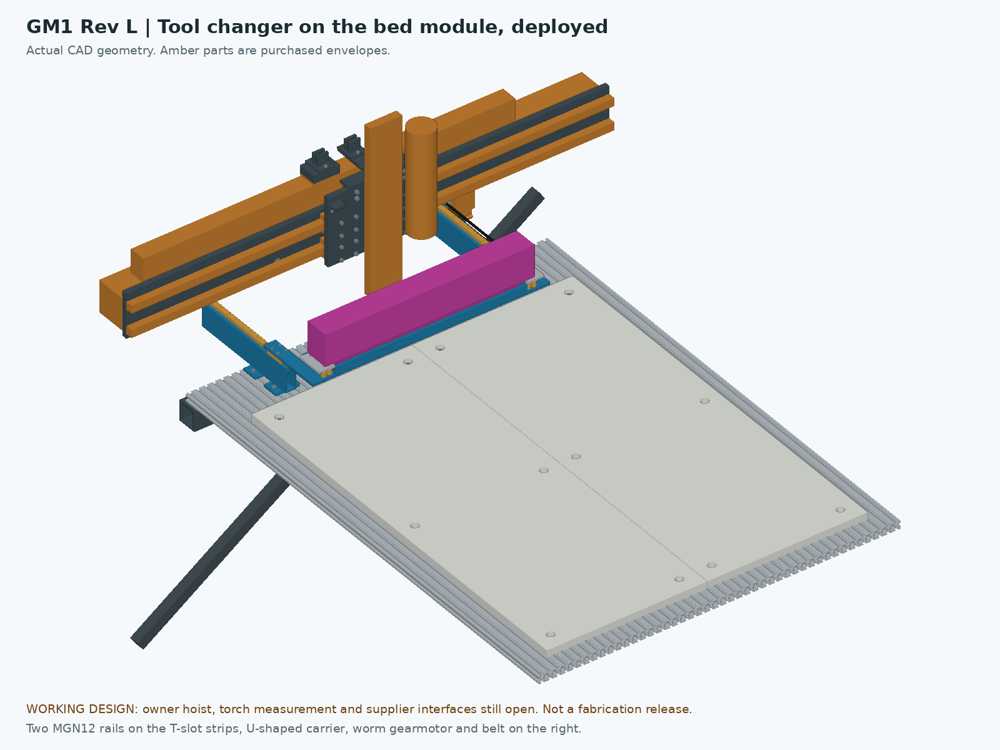

# GM1 Rev L — 300 mm Z and a RapidChange tool changer on the bed

**GM1 — Garcia Mechanical Table.** Working design for review, **not released for purchasing, fabrication, CAM or operation.** In the previews, amber parts are purchased-part envelopes and magenta parts are allocations for the tool changer's magazine and stored cutters, not supplier drawings.

Rev L is [Rev K](../RevK-CAD/README.md) with two changes the owner asked for on 27 September 2026:

- **A 300 mm Z slide** instead of 100 mm. The ZBX80 order goes in on Monday 28 September.
- **A RapidChange-type automatic tool changer** ("yes i do"; "the rapidautochanger or something like that"). Its magazine retracts on a short slide, so the 800 × 1000 mm work area stays free.

Everything else is Rev K's, unchanged: the frame, the one-piece bed module and its hoist, the water table, the plasma head and torch, the cabinet. The GM1 controls gain spindle reverse and the tool-changer drive (M12 and M13 in the [controls README](../../controls-2026-09-27/README.md)).

- [Router assembly STEP](step/RevL_ROUTER.step): dock parked, gantry at the rear stop, Z fully up
- [Bed module STEP](step/RevL_BED_MODULE.step): the module with the dock deployed, as the hoist lifts it
- [Dock STEP](step/RevL_DOCK.step): the tool changer alone, deployed
- [New parts](step/RevL_NEW_PARTS.step): the dock's parts and the 300 mm Z body, with the [component schedule](cutlist.csv), [operations](part-operations.json), [individual STEP parts](parts/) and [flat DXFs](dxf/)
- Previews: [router](previews/RevL_ROUTER.png), [router from the right](previews/RevL_ROUTER_side.png), [tool change](previews/RevL_TOOL_CHANGE.png), [dock close-up](previews/RevL_DOCK_DETAIL.png), [bed module](previews/RevL_BED_MODULE.png)
- Checks: [poses, dock travel, tool change and hoist path](revl-checks.json), [manifest and source hashes](engineering-manifest.json), and the validations of each STEP
- [What Rev L adds to the shopping list](../../../outputs/reve-30510/actual-cost/REVL-PROCUREMENT-DELTA.md)

## The 300 mm Z

The ZBX80 is the same type with a longer body. The model keeps the lower end where it was:

- The spindle nut still reaches Z960 at the bottom, 1.2 mm above the HDPE, so nothing changes for cutting.
- At the top the nut is at **Z1260** instead of 1060.
- The body grows 200 mm upward, to Z1040–1459. Its length is scaled from the 100 mm drawing (stroke + 119 mm); measure the delivered unit.
- The braked motor's top moves from Z1430.5 to **Z1630.5**, 1.63 m above the floor. Nothing on the machine is above it, and it is well under the 8 ft ceiling and the A-frame beam.
- The plasma torch tip now reaches Z845–1145.

**Why 300 and not 200.** RapidChange asks for at least 90 mm between the magazine and the spindle nut with Z fully up. The magazine sits on a tray above clamped stock, at Z1050.35.

- A 200 mm Z would give 110 mm, which is 20 mm to spare.
- A 300 mm Z gives **210 mm**. That leaves room for longer tools, taller clamps, and whatever the delivered magazine and its cover really measure. The allocation here is 80 mm tall, and the kit's real height is not published.
- The cost is a slightly dearer slide, 100 mm more height and about a second more per tool change.

An earlier note (commit `3a674bf`) said the dock would have to sit up to 45 mm higher to clear the bed lift. It doesn't: Rev L mounts it on the bed module instead (below), which keeps the other session's magazine height. The recommendation stays 300 mm, for the margin.

## The tool changer (dock)

The dock rides **on the one-piece bed module**, behind the HDPE. Every part is named `MOD_ATC_*`, so it is part of the module:

- **It lifts out with the bed.** Nothing has to come off the machine before a bed change.
- **Plasma never sees it.** In plasma mode the module, and the dock with it, are on their stand outside the machine.
- **Nothing is added to the frame.**

The other session's carrier (base branch, [retractable ATC](../../../variants/retractable-atc/README.md)) was drawn for the six-panel bed. On this bed its rails and shelves would sit where the module rises 70 mm, and where the rear lifting lugs and sling legs are. Rev L keeps its heights and its 200 mm stroke and moves the guides onto the module.

| Item | Rev L |
|---|---|
| Guides | Two HIWIN MGNR12 rails, 281 mm, one MGN12H block each, at X295 and X855 |
| Rail beams | 1 × 2 in steel tube on two T-slot feet each, bolted into the strips' top slots at X275/315 and X835/875, behind the HDPE (Y1170–1280). Each beam runs back past the module's rear edge to Y1445 |
| Rail seat | Steel bar on the tube, machined flat at Z1007 after welding |
| Carrier | One 1/4 in steel plate at Z1020–1026.35: a tray under the magazine and two arms back to the blocks. The middle behind the tray is open |
| Magazine | Allocation 520 × 60 × 80 mm on two blank aluminum saddles; support plane **Z1050.35**; pocket line **Y1100** when deployed |
| Stored cutters | Up to 15 mm diameter, hanging at most 36.55 mm below the magazine (Z1013.8), through a window in the tray |
| Travel | 200 mm. **Deployed:** magazine at Y1070–1130, over the rear 60 mm of the bed. **Parked:** Y1270–1330, behind the Z body and under the gantry |
| Drive | 24 V worm gearmotor (about 30 rpm) and a GT2 belt on the right beam; about 20 mm/s, 10 s end to end. The worm holds the carrier |
| Stops and sensing | A fitted front stop is the deployed datum (the pocket positions depend on it); a soft rear stop. One end microswitch per direction cuts the motor at the end. Two M8 inductive sensors tell the Rodent where the carrier is |
| Connection | One M12 8-pin plug at the back of the module, for the motor and the sensors. Unplug it before a lift. The magazine's cover and IR lead need a second plug, not yet defined |
| Mass | About **10.6 kg**, with 3.3 kg allowed for the magazine and cutters. The module becomes about 74 kg |

**Clamping near the back of the bed.** When deployed, the tray covers the rear 65 mm of the HDPE (Y1065–1130), with its lowest screw heads at Z1015. In that strip, keep stock and clamps under 50 mm tall. Elsewhere the dock does not limit them.

### Tool change: one rule

The bottom of the Z slide's body (its end block, Z1040–1052) is lower than the magazine top (Z1130). **So the Z body can never pass over the deployed magazine.** The spindle has to reach the pockets from behind:

1. Stop the spindle and raise Z fully.
2. Move the head to **X975**, then the gantry to the rear stop (Y1275). The Z body is now beside the magazine.
3. Deploy the dock and wait for its "deployed" sensor.
4. Move the gantry to the pocket line (gantry Y1253.6), then along X to each pocket. RapidChange unloads in reverse (M4, about 1600 rpm) and loads forward (M3, about 1500 rpm). Go back up to full Z between pockets.
5. Move the head back to X975, park the dock, wait for "parked", and carry on.

**While the dock is out, never move the gantry forward of Y1215 with the head between X270 and X880.** The RapidChange grblHAL macros must be set up this way; their default approach is not safe here. The checks include that forbidden move to show it collides.

### Changing beds with the dock

**Router to plasma:**

1. SETUP, bed key UNCONFIRMED. Take the spindle out, as in Rev K.
2. Gantry to the rear stop, head at X975, Z fully up. **Deploy the dock.** Then move the head to X575. The deployed magazine lies ahead of the Z body, and the carrier's open middle lets the Z body's lower end sit over it.
3. **Unplug the dock** at the back of the module.
4. Lift and roll out as in Rev K, with two changes:
   - **Hook over Y745**, the module's new centre of mass, instead of Y670. With the 0.7 m sling, the rear legs are about 70 mm shorter than the front ones. Use a chain sling with shortening clutches.
   - **Roll about 1.52 m** instead of 1.42, because the dock's rear end is at Y1449.
5. Set the module down with the magazine up. It sticks up about 170 mm above the HDPE.
6. Plasma as in Rev K.

**Plasma to router:** lower the module in and refit the six screws, as in Rev K. Then plug in the dock, park it (head at X975, gantry at the rear stop) and **probe the pocket reference** before the first tool change. RapidChange needs the pockets within 0.2 mm, and the module's locating pins are not proven to that.

## Controls

These are M12 and M13 in the [GM1 controls](../../controls-2026-09-27/README.md), with their simulation checks.

- **Spindle reverse (M12).** RapidChange unloads with the spindle in reverse. A force-guided relay K_DIR at the end of the run chain sends the run command to FWD or REV, never both. The Rodent's spindle direction goes to the V-MOS HE1 output (GPIO2).
- **Dock drive (M13).** Two relays (run and direction) drive the gearmotor. Its 24 V comes through the E-stop contactors and a spindle-run interlock, so the dock cannot move while the spindle is commanded, and it stops at every E-stop. The end microswitches stop it even if a relay welds.
- **I/O.** The Rodent reads the two dock sensors and drives the two relays through its MCP23017 expander. Inputs and outputs are reserved there for the magazine's IR check and cover.
- The RapidChange electrical interface (cover, IR) comes from the delivered kit.

## What was checked

`verify_revl.py` → [revl-checks.json](revl-checks.json). Every record is hash-bound to its sources.

| Check | Result |
|---|---|
| Router: the X/Y/Z travel corners (Z 0 and 300) and the centre, dock parked | **Pass**: 9 poses, 0 unresolved overlaps |
| Plasma: the same nine poses and Rev K's three plasma-only poses, module and dock out | **Pass**: tip Z845–1145; over slat 8 it is 5.0 mm below the slat top, within the 6 mm float |
| Dock travel, 0–200 mm in 20 mm steps, gantry at the rear stop, head X975, Z up | **Pass**: 11 positions |
| Tool change: spindle on the pocket line at X345, X575 and X805, at Z up and 5 mm above the magazine | **Pass** |
| Tool change: nut at the magazine plane | Only the pocket interface is touched: the magazine and stored-cutter allocations, and at the end pockets the saddle blanks by 0.35 mm, because the spindle is drawn as a Ø65 cylinder right down to the nut. The Z body, adapter and clamp clear the dock |
| Forbidden move: gantry forward of the deployed magazine (Y1150) | Clashes, as expected: the Z body's end block and base hit the magazine and the tray upstands |
| Deployed dock against 50 mm of stock and clamps over the HDPE | **Pass**: clear |
| RapidChange 90 mm rule | 209.65 mm from the magazine plane to the nut at full Z |
| Hoist path with the dock deployed on the module: hook 0.7, 1.0 and 2.0 m above the lugs, over Y745, rolled 1.52 m | **Pass**, 78 sampled poses each, and no sling leg touches the dock. At 0.7 and 1.0 m the nearest gaps are Rev J's: frame legs 11.2 mm, float backrails 14.5 mm. At 2.0 m a rear leg passes **2.8 mm** from the rear-parked X rail (8.6 mm in Rev K), because the hook moved back over the new centre of mass: don't use the 2.0 m sling. The container plan uses 0.7 m |
| Static interference of the exported states: router with the dock parked (1,299 solids), bed module with the dock deployed (228), dock (79), new parts (80) | 0 unresolved overlaps; STEP reimport matches |

These are nominal CAD checks. They do not cover stiffness at the pocket, the delivered magazine, cable routing, or the sling's real shackles.

## Still open

- **The magazine.** Pocket count, pitch, mounting holes, nut datum, cover sweep and cable come from the delivered RapidChange kit. The saddles stay blank until then. Its height sets the parked clearance: the 80 mm allocation leaves 12.6 mm under the gantry's Z carrier at the rear stop.
- **Pocket accuracy.** RapidChange asks for 0.2 mm. The front stop and the preloaded belt clamp should repeat to 0.05 mm; prove it in 20 cycles with an indicator. Probe the pocket reference after every bed install.
- **Stiffness.** One block per rail. The load at the pocket is a nut threading on at low speed, but check the tray's deflection under a 150 N push at the pocket.
- **Drive parts.** The gearmotor, pulleys, belt clamp spring and sensors are chosen by function. Fit the gearmotor's face to the motor plate once it is in hand.
- **Tool length.** A tool setter is not drawn. It could sit on the dock's right saddle.
- **Chips and coolant.** The rails, belt and gearmotor sit at the back of the bed. Cover the rails (a sheet-metal cover or bellows) and use a sealed gearmotor or shield it; neither is drawn. The sensors and the plug are IP67 parts.
- **The Z slide.** The 300 mm body length is scaled, not measured. Measure its carriage and end blocks on receipt, as MOTION-MODULES.md lists.
- **Rigging.** The chain sling needs shortening clutches for the rear legs. At the 0.7 m hook height the front legs sit at about 41°; use rigging rated for that angle. Don't use a 2.0 m hook rise: a rear leg then passes 2.8 mm from the X rail.
- **Rev K's open items** still apply.

## Sources

In [RevL-ENGINEERING](../RevL-ENGINEERING/), kept apart so the Rev K and shared RevE-ENGINEERING source inventories are unchanged:

- `build_revl.py`: builds the states and exports them; Rev K's `build_revk.py` is used unchanged.
- `z300.py`: the 300 mm Z slide on Rev J's motion model.
- `atc_revl.py`: the dock.
- `verify_revl.py`: the checks above.
- `render_revl.py`: the previews.
