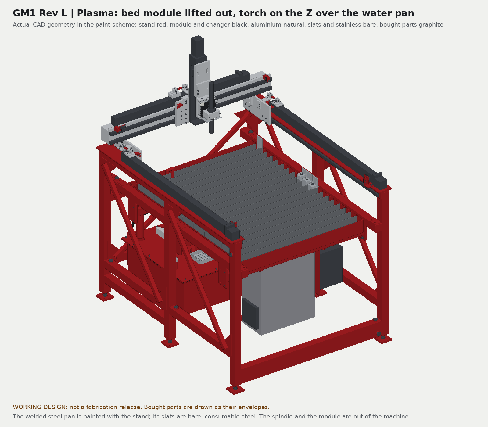
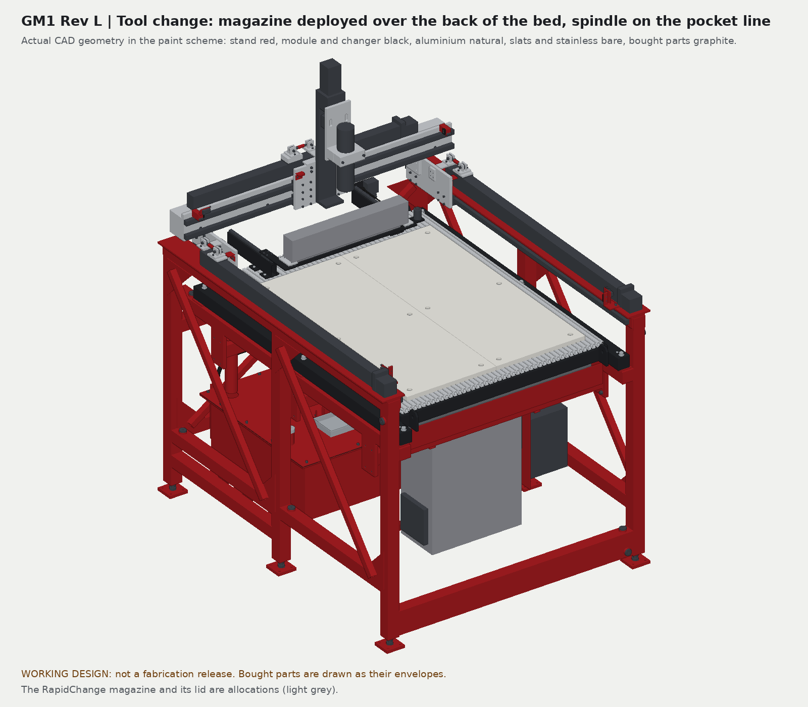
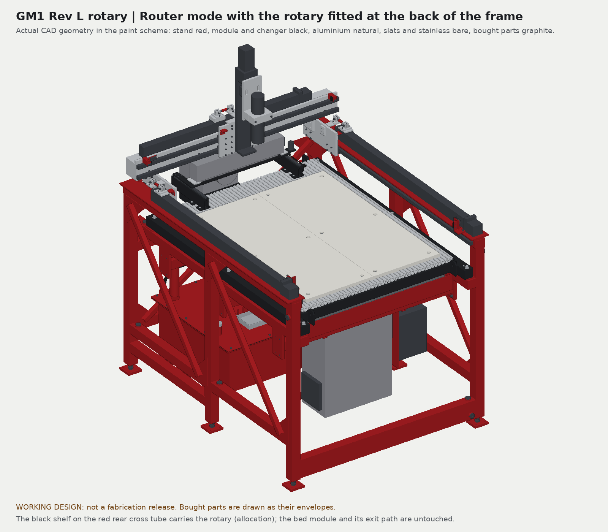
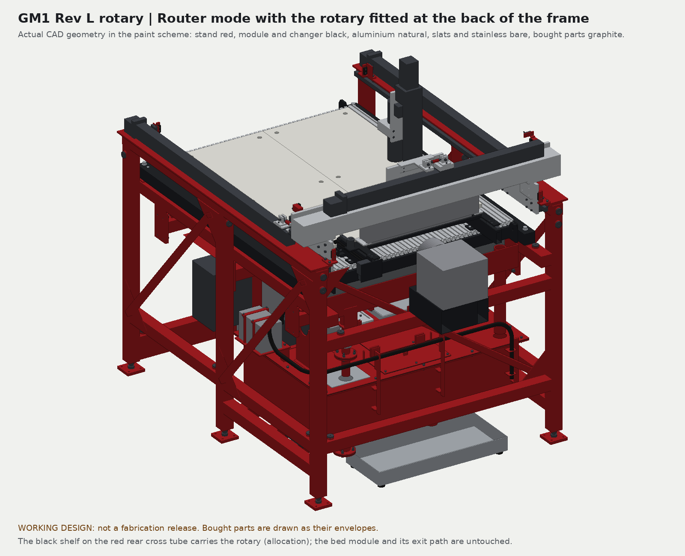
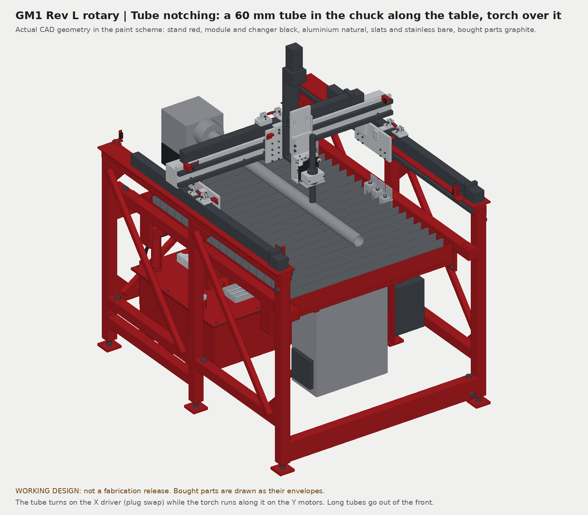
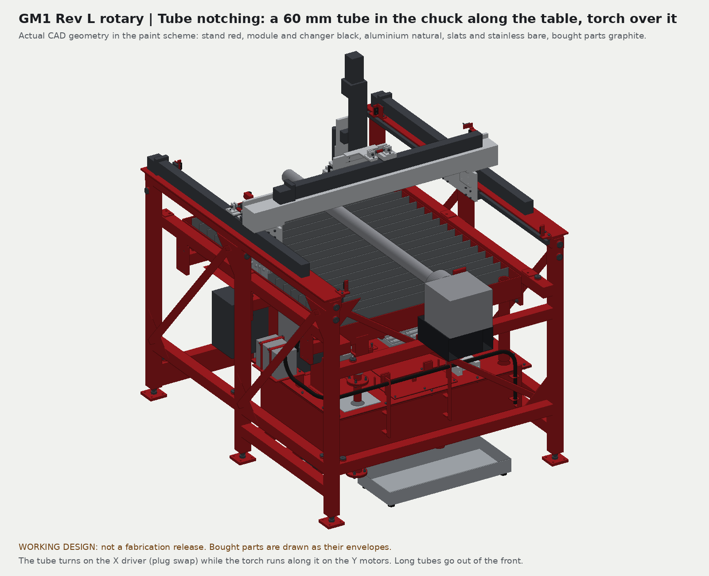

# GM1 renders: every version in the paint scheme

Presentation renders of the actual CAD (the same builds as the packages, no illustration parts) in the owner's scheme (28 September): **steel painted red and black, aluminium in its natural finish**. Made by [`render_paint.py`](render_paint.py); the record of each run is in [renders.json](renders.json).

| Colour | What |
|---|---|
| Red | The welded stand: frame, legs, bracing, feet, pan bearers, the welded steel water pan and reservoir, cabinet frame and drip cap, cradles |
| Black | What lifts out or bolts on: the bed module weldment, the tool changer's steel, the plasma head's steel, the rotary shelf |
| Natural aluminium | Gantry plates, Z carrier, adapters, bed strips, rack bar |
| Bare | The plasma slats and their combs (consumable steel), the stainless floats, guards, catch basket and drain parts, the HDPE bed top, MDF |
| Graphite | Bought parts drawn as their envelopes: rails, blocks, slide, motors, spindle, torch, switches, magazine |
| Light grey | Allocations: the RapidChange magazine and lid, the BT30 holders and forks, the rotary and its chuck, the workpiece tube |

## Rev L, the ER11 machine

| | |
|---|---|
|  |  |
| Router: tool changer parked behind the Z, Z up | Plasma: bed module out, torch over the water pan |
|  | |
| Tool change: magazine deployed, spindle on the pocket line | |

## BT30 variant

| | |
|---|---|
|  |  |
| Router: BT30 spindle in its clamp, fork rack parked | Plasma: module and rack out, spindle parked on the reservoir lid |
|  | |
| Tool change: spindle nose down on the holder in pocket 3 | |

## Rotary variant (tube notching)

| | |
|---|---|
|  |  |
| Router mode with the rotary on the rear cross tube | The same from the back |
|  |  |
| A 60 mm tube in the chuck, torch over it | The same from the back |

The engineering previews in each package's `previews` folder keep the working colours (amber envelopes, magenta allocations) that the checks refer to.
