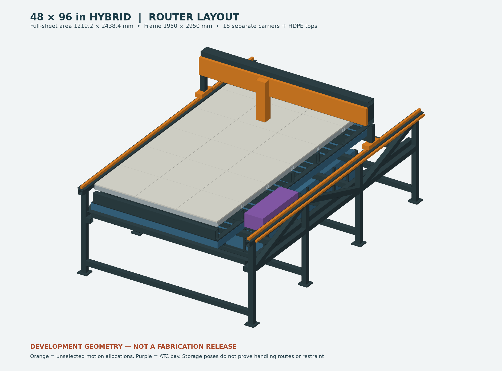
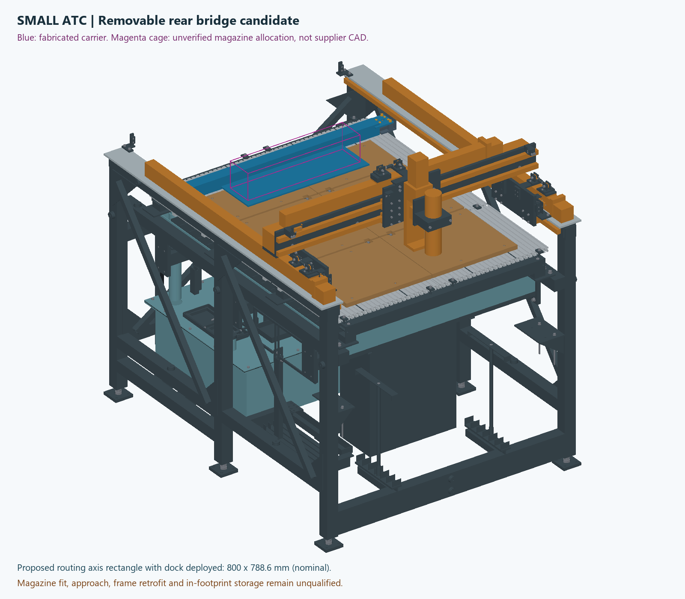

# Small ATC and full-sheet 4x8 variants

Two development variants extend the [existing Rev I small machine](../output/release-review/RevI-CAD/README.md).
The requested ATC, repeatable removable table interfaces and second full-sheet
machine are now separate design work. Rev I remains the small-machine baseline;
its existing checks do not automatically qualify these additions.

| Design | Working area / stock | Bed and ATC arrangement |
|---|---|---|
| [Small machine with ATC](small-atc/README.md) | Existing nominal 800 X × 1000 Y × 100 Z; proposed routing rectangle with dock installed is 800 × 788.6 mm, pending full tool sweep | Existing 20100 bed retained; removable rear dock supported from frame |
| [Full-sheet 4x8](48x96/README.md) | 1219.2 × 2438.4 mm stock; extra travel for deck surfacing and side ATC bay | Provisional 1320 × 2550 mm bed, 3 × 6 aluminum/HDPE carriers, 1950 × 2950 mm chassis plan |
| [Shared locating interfaces](common/location/README.md) | Metal datum chain, independently checked fits and thermal allowances | Round pin + diamond pin, replaceable metal bushings, hard Z seats and separate clamps |

The large dimensions assume 4x8 means usable sheet size. ATC space is provisioned
on both variants while the exact kit and which machine receives it first remain
unconfirmed. The [requirements record](requirements.json) distinguishes requests,
working assumptions and open inputs.

## Repeatable removal

Locate each metal carrier with one round pin and one relieved/diamond pin.
The first fixes two horizontal directions; the second fixes rotation without
forcing a second fully constrained hole spacing. Three hard seats define the
height plane. Supplementary supports must be fitted to that plane, and separate
clamps provide hold-down. Precision pins are not pressed into HDPE.

The HDPE top is a wear layer attached with room for thermal movement and metal
compression limiters. Its expansion must not move the carrier's locating
features. Each reinstallation requires clean datums, correct seating, clamping
and a reference check. Numerical return targets in the common interface are
acceptance targets, not demonstrated machine accuracy.

The common locator assembly is modeled separately. Its integration into the
small table and all 18 large carriers remains open; the table models do not yet
contain the completed pin, clamp and thermal-clearance details.

## ATC is more than a magazine

The [control integration](common/controls/ATC-INTEGRATION.md) adds a pin allocation
for spindle direction, a fixed router toolsetter, IR status, cover control and
dock presence. A [static source check](common/controls/pin-reservation-check.json)
checks connector identities and GPIO/interrupt conflicts. It does not implement
M6 or prove the actual spindle/VFD can reverse at the required low speeds.

Manufacturer mounting geometry and the exact RapidChange kit are still required
to release the drilled adapter and pocket coordinates. Colored ATC allocations
in CAD represent reserved space, not a supplier-certified magazine solid.
The installed small-machine dock consumes part of its work area; the large
machine reserves a side bay beyond the sheet. Removal must preserve or re-establish
the pocket reference before automatic changes resume.

The approximately **USD 700** kit figure is a user budget target. Official shop
pages currently present different prices/options. It is not a delivered quote
and excludes any unquoted freight, tax, extra tooling and interface parts.
The [kit comparison and manufacturer requirements](common/atc/README.md) record
the sourced prices and the exact dimensions that still need confirmation.

## Scope of this package

The links above include generated CAD, checks and explicit limits. The large
machine is a layout with unselected motion components and unfinished joint,
service and conversion details. The small dock is a candidate that requires the
actual kit and spindle dimensions. Neither is a fabrication or CAM release.

The existing [Rev I concept PDF](../output/pdf/plasma-router-stand-concept.pdf)
continues to describe the baseline small machine. It is not silently relabeled
as the new 4x8 or an ATC-qualified model. See the variant pages for new geometry.

The [package check](package-verification.json) binds the new reports and files
to their source and checks that the prior baseline remains unchanged. A PASS
there concerns the published evidence, not fabrication or machine operation.
