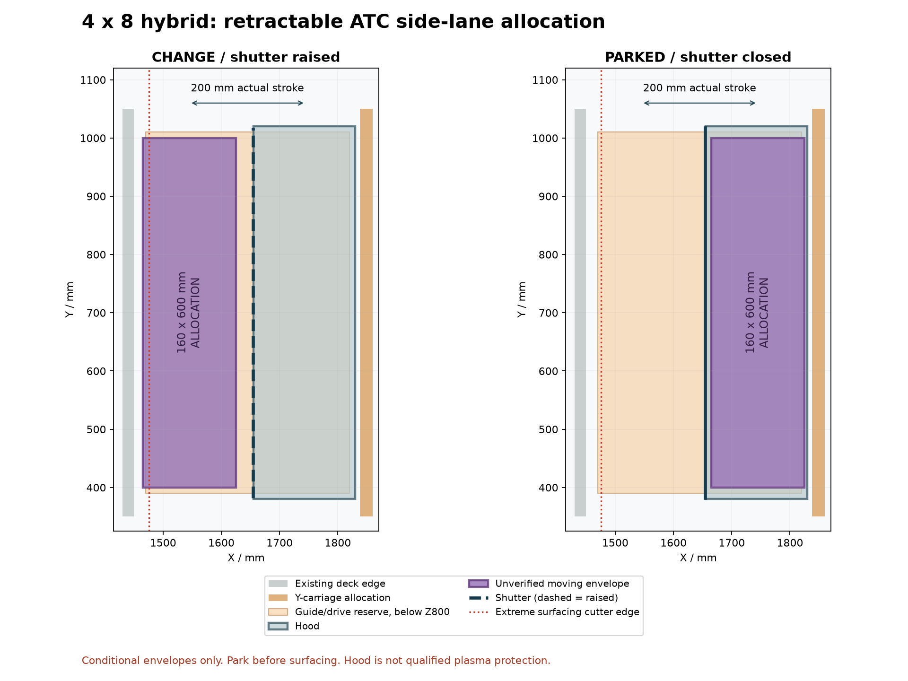

# Retractable ATC on both machines

Requested on 26 September 2026: move each ATC magazine on a short linear slide
so it does not permanently consume the routing area. The working target is
**200 mm useful stroke**. A rail advertised as 200 mm long is a different size.
This is a packaging study, not a selected actuator or released installation.

## What the slide must accomplish

During routing, the magazine parks clear of the tool, moving head, gantry,
stock and clamps. For M6, the machine moves to a verified clearance pose, the
magazine deploys, seats against its reference stop and locks. The spindle can
then visit its calibrated pockets. Before ordinary machining resumes, the
magazine returns to its parked position and its cover closes.

The guide supports and guides the carriage; it needs a separate actuator.
A screw drive or a suitably guided pneumatic arrangement are candidates.
The existing compressor does not identify a cylinder, valve, pressure setting
or holding mechanism. No actuator or solenoid is selected here.

The motion guide must resist the actual magazine mass, cantilever and
tool-change reaction. Final position needs a positive reference and holding
arrangement; simply driving into a microswitch does not qualify pocket
alignment. A removable magazine can retain separate metal locating features
on top of the sliding carriage. Existing vertical locating pins cannot simply
stay engaged during a horizontal slide.

## Machine-specific result

| Machine | Proposed arrangement | Present conclusion |
|---|---|---|
| [Small machine](small-study/README.md) | Compact rear magazine moving 200 mm in Y | A parked corridor is possible for an assumed 60 mm body depth. The current low shelf collides with full-area stock during deployment. Extra Z clearance and a redesigned tray/support are required to preserve the usable area through M6. |
| [Full-sheet 4x8](large-study/README.md) | Magazine moving 200 mm across the existing dry side bay | A narrower assembly can fit the side corridor without occupying the 48x96 sheet. The previous 200 mm-wide allocation is too wide for a full 200 mm slide. Full-deck surfacing requires the rack parked. |

The old small-machine bridge cannot simply be translated 200 mm rearward: its
shelf still interferes with the low spindle. Moving only the magazine also
leaves that fixed shelf in the work area. The small study therefore proposes
a new compact moving tray, with its support and height still to redesign.

The compact dimensions are conditional envelopes. The supplier confirms a
current nominal magazine width of 60 mm, but exact endcaps, cover motion,
tool projections and mounting geometry still require the selected kit's CAD.
The manufacturer also specifies 90 mm Z clearance for a non-inset installation.
The inherited small-model spindle datum is an approximation, so its clearance
arithmetic is a screening result rather than a measured spindle qualification.
[RapidChange FAQ](https://rapidchangeatc.com/faq/).

## Rail length versus travel

For a fixed rail, useful travel is limited by rail length minus the occupied
bearing-block span and the allowances at both ends. As an illustrative
manufacturer dimension, the HIWIN MGN12H block has nominal length 45.4 mm.
[HIWIN MGN12HZ1CM dimensions](https://www.hiwin.de/en/Products/Linear-guideways/Blocks/Miniature-guides/MGN-HIRES-series/MGN12HZ1CM/p/MGN12HZ1CM).

The catalog gives a maximum block envelope of 45.8 mm including screws and
end-seal lips. With two blocks on each rail, 80 mm between their centers and
a 10 mm allowance at each end, the minimum length for 200 mm travel is:

`200 + 80 + 45.8 + 10 + 10 = 345.8 mm`

Using only nominal block length would give 345.4 mm. The example uses the
maximum envelope. [HIWIN catalog, PDF page 91 / printed page 88](https://www.hiwin.com/wp-content/uploads/HIWIN-Linear-Guideway-Catalog.pdf#page=91).

A **350 mm rail** is therefore an illustrative packaging size for that block
arrangement. It is not a capacity-qualified purchase recommendation. A 200 mm
rail gives only 54.2 mm travel with those two blocks, or 134.2 mm with one block
and the same end allowances. Actual seals, fittings, tolerances, stops and the
chosen actuator can increase the required length. See the executable
[arithmetic check](check_guide_stroke.py) and [results](guide-stroke-check.json).

## Required control sequence

This is an interface definition; no working M6 or slide-control firmware is
issued with the study.

1. Permit ordinary routing only with verified PARKED and cover-closed states.
2. For a requested tool change, establish the actual spindle stop/clearance
   conditions and a collision-free machine pose before moving the rack.
3. Deploy; verify the deployed and locked states, with a timeout for each move.
4. Run the calibrated RapidChange operation only while the dock stays locked.
5. Retract the spindle, return the rack, and verify PARKED/CLOSED before resuming.
6. A position contradiction, timeout, lost clamp state or interrupted threading
   requires controlled recovery and reference verification. A restart must not
   automatically resume an uncertain tool-change cycle.

The current controller reservation provides only a dock-present signal. It does
not yet provide the additional parked/deployed/locked/cover signals and actuator
outputs needed here. Those require a checked I/O expansion or revised allocation.
The existing emergency-stop and hardware tool-power permissions remain separate.

A dust cover is not established plasma protection. The magazine needs a verified
dry, spark-protected parked enclosure or removal for plasma operation. The
studies do not qualify enclosure sealing, grounding, fire resistance or an
energized machine.

## Release boundary

The slide concept has been added as a separate study so the earlier dock and
4x8 model evidence remain readable. It does not silently replace those models
or establish full-bed automatic operation. Exact kit dimensions, actual tool
and stock/clamp envelopes, selected guides/actuator, complete attachments,
deflection and repeatability, and the controls remain to finish.
