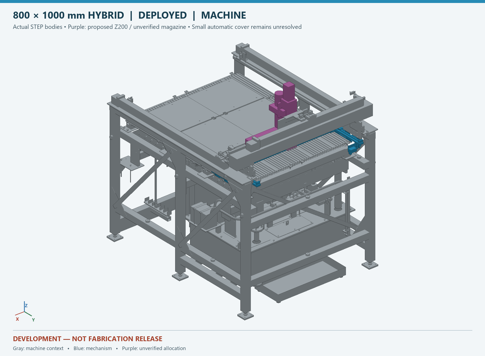
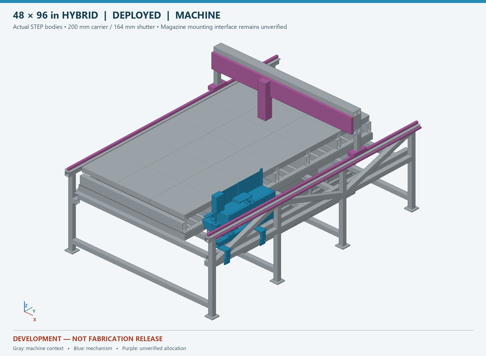

# Retractable ATC — small and full-sheet machines

The latest revision develops the requested **200 mm magazine travel on both machines** into separate mechanical assemblies, sourced drive interfaces, automatic locking arrangements and an executable control sequence. Use the two mechanism pages below for current CAD. The earlier `small-study` and `large-study` folders preserve the first packaging studies; they are not the current assemblies.

**Status: engineering development, not a fabrication/CAM release or an operating ATC.** Exact magazine geometry, the small machine's proposed longer Z, actual spindle/VFD behavior and physical qualification still determine whether the installation can work as modeled. The preserved Rev I machine has not silently acquired those capabilities.

| Machine | Current arrangement | Design constraint |
|---|---|---|
| [Small machine: CAD, drawings and checks](small-mechanism/README.md) | Rear tray moves 200 mm in Y on two 350 mm rails; raised, open carrier gives stored cutters space below the magazine | Targets the nominal 800 × 1000 mm work rectangle with a working 50 mm combined stock/clamp height. Requires the proposed longer Z configuration; the original Z remains 100 mm. |
| [Full-sheet 4x8: CAD, drawings and checks](large-mechanism/README.md) | Magazine moves 200 mm across a separate side bay; removable adapter strips sit above a guided carrier | Keeps the nominal 1219.2 × 2438.4 mm sheet area separate from the magazine. Deck surfacing and head access still depend on the defined parked pose. |

The magazine is located and held by the mechanism at each endpoint. Its drive screw is not the precision stop or the only means of restraint. Spring-engaged guided pins have separate release actuators and feedback from the pins themselves. The fabricated carrier and its replaceable magazine mounting plates are distinct parts; vendor mounting holes and pocket coordinates remain undrilled and uncalibrated until the exact kit is identified.

## Current CAD views

These previews are rendered from the delivered STEP assemblies. Purple geometry identifies an unverified supplier allocation or proposed motion package; it is not a purchased-part drawing.

The mechanism pages also show the parked states and closer views. [Preview verification](preview-verification.json) binds the images to their STEP files.

## Guides, drives and covers

The proposed guides use the sourced **HIWIN MGN12H/MGNR12** mounting geometry: two 350 mm rails and four blocks per slide. A 200 mm rail is too short for 200 mm motion with two separated blocks. The bounding calculation is `200 + 80 + 45.8 + 10 + 10 = 345.8 mm`; [the checked arithmetic](guide-stroke-check.json) uses the maximum published block length. These catalog dimensions do not give an inexpensive clone HIWIN load ratings.

The drive candidate is a **STEPPERONLINE 17E19S1684MB4-300RS**, with an integrated 300 mm TR8×8 screw. Its 8 mm lead is for the new magazine/shutter drives, not a change to the original X/Y axis lead. [Sourced dimensions](hardware/source-data.json) distinguish the current model, published alias and unverified delivered details. Holding torque alone does not establish running thrust or a brake function.

The locking arrangement uses separate [Delta release solenoids](hardware/LOCK-ACTUATOR.md) and [noncontact pin sensors](hardware/PIN-SENSORS.md). The guided pin and housing carry the lock reaction. A light return spring, actual friction, hot-coil pull and release timing require measured qualification. Sensor electronics cannot prove that a blocked optical slot contains the intended pin flag.

The large machine has a separate powered outer shutter and dust enclosure. The small machine currently has the carrier and locks only: its constrained rear corridor does not establish room for that same shutter. Its cover arrangement remains a specific unfinished interface, and its automatic profile must remain disabled. Neither arrangement is qualified as a plasma spark or fire barrier. **The new control candidate denies plasma permission**, including when the magazine is parked. Plasma conversion requires a qualified protected arrangement or a separately verified removal/configuration workflow.

## Control sequence and onboard drivers

The [controls package](controls/README.md) defines Kraken S5 for the magazine slide and S6 for the large machine's outer shutter, with isolated field inputs and separate lock outputs. The small machine has no assigned outer-shutter travel or completed automatic profile. The design retains the user's preference for onboard stepper drivers. S5/S6 use the documented 75 mΩ current-sense value; their settings cannot be copied blindly from Kraken V1.1 S1–S4.

The [terminal/circuit definition](controls/WIRING.md) and [I/O allocation](controls/io_plan.json) specify the added interfaces. The existing hardware stop and tool-power permission remain independent. The new relay contact belongs in series with the existing run-arm path, without a bypass. VFD and kit feedback channels remain open interfaces until their actual electrical signals and meanings are known.

The offline sequence stops the spindle, confirms a current clearance pose, opens and captures the shutter, releases both magazine pins, deploys, confirms the matching endpoint and lock, and only then permits the calibrated tool operation. It requires another verified clearance pose before retracting and reclosing, then confirms the shutter's closed retaining pin before restoring router permission. Invalid feedback, missing endpoints, stale data and interrupted cycles inhibit permission and require deliberate recovery.

This package contains **no flashed firmware, functioning M6 integration or calibrated pocket coordinates**. Its default configuration does not energize hardware. Simulation and source checks demonstrate the specified behavior only; they do not qualify a populated control cabinet or an energized machine.

## Evidence and fabrication boundary

The small machine's bed-removal sequence was revised around the installed rear guides. Its checks cover 42 panel, 60 spoilboard and 31 beam movements within the modeled frame footprint. Conversion remains manual, with defined tool/fastener/restraint preconditions; these checks do not include the operator's hands or flexible leads.

- [Small mechanism verification](small-mechanism/verification.json) and [large mechanism verification](large-mechanism/verification.json) bind their specific modeled checks to the sources and exported artifacts.
- [Control verification](controls/verification.json) records the offline sequence and fault checks.
- [Independent export verification](export-verification.json) reopens STEP/DXF files without importing the geometry generators. It checks valid positive-volume solids, millimetre drawing units, file structure and circular feature correspondence between each drawing and its part. It does not establish assembly clearance, complete machining setups or rigidity.
- [Publication verification](../package-verification.json) checks source/artifact hashes, local document links and the unchanged Rev I baseline.

Remaining release inputs are concrete: the selected RapidChange kit's dimensions and mounting pattern; loaded tool/nut geometry; the proposed small Z module's drawing and retained-load behavior; actual spindle low-speed forward/reverse performance; measured alignment, loaded deflection and pin repeatability; and tested electrical/firmware integration. The mechanism pages identify any additional CAD findings and incomplete fabrication details. The 4x8's purchased main motion, structural joints and complete bed conversion also remain separate development work.

The working 50 mm stock/clamp height is an assumption, not a confirmed user limit. Clearance must be checked against the actual tallest clamp and longest stored cutter. A blank supplier interface in a STEP file is not permission to guess the drilling pattern.

The approximately **$700 ATC kit target** excludes unquoted installation hardware, freight, taxes and tooling. Component source records distinguish observed goods prices from missing delivered quotes. No complete build total is asserted by this revision.

Primary references: [RapidChange requirements](https://rapidchangeatc.com/faq/), [HIWIN guide catalog](https://www.hiwin.com/wp-content/uploads/HIWIN-Linear-Guideway-Catalog.pdf#page=91), [BTT Kraken documentation](https://global.bttwiki.com/Kraken.html). The [requirements record](../requirements.json) separates confirmed requests from assumptions and unresolved interfaces.
